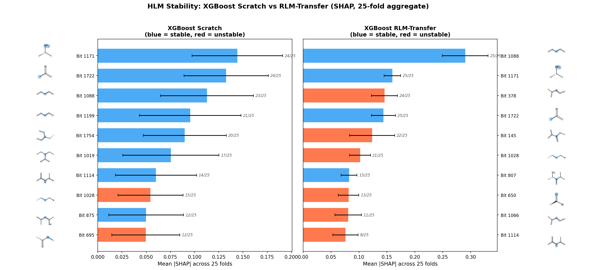
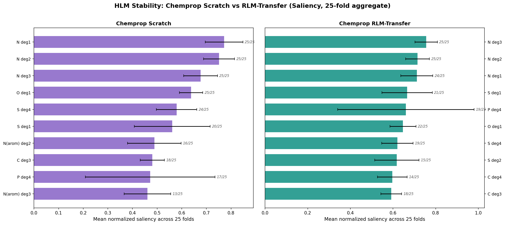
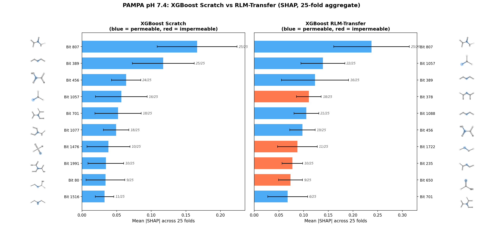
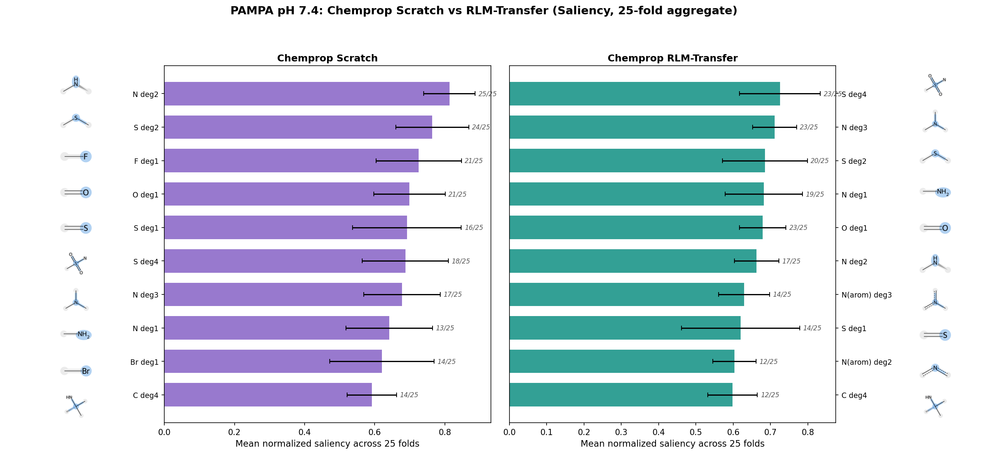
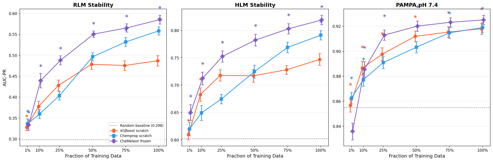
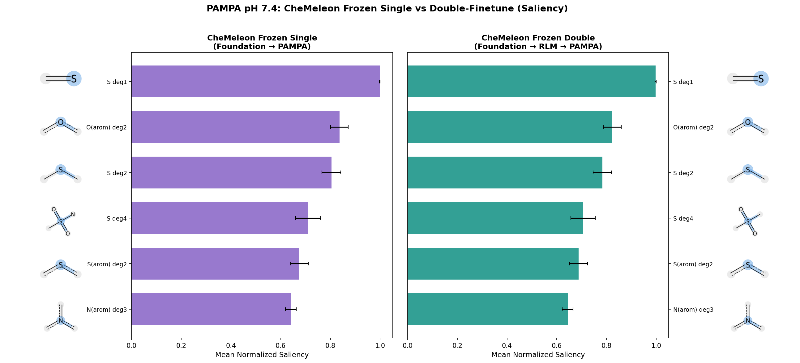

# Transfer Learning for Drug Discovery Primer

Disclaimer / slop warning - The code generating the results and much of the first draft of this document was written by AI. I've reviewed it, but initial drafts were full of errors and I may have missed something. In particular, I am not a biochemist nor have experience working with ADME assay data, so my efforts at auditing sections dicusssing those directly may not have resulted in me catching errors which could appear obvious to someone who has more experience in those domains.

This codebase explores a practical question: does transfer learning help for ADME (Absorption, Distribution, Metabolism and Excretion) prediction (yes), and does it matter what model type you use and how you perform that knowlege transfer (yes), and why? It also serves as an introductory explainer for curious (and skeptical) scientists to transfer learning for machine learning models in small molecule drug discovery. The background context, and experiment to address some core questions, and the findings are discussed in detail in this document.

Predicting how a drug candidate behaves in the body -- whether it's absorbed, how quickly the liver breaks it down, whether it crosses cell membranes, what protein targets it binds to -- is central to drug discovery. Machine learning models can learn these predictions from experimental data, but experimental data is expensive and scarce. A typical assay in a particular program might produce a few hundred to a few thousand measurements. Transfer learning is a common technique to overcome the limitations of these small datasets. First train a model on a large dataset, then adapt it to a smaller target dataset. The idea is that the model picks up general chemical patterns from the source data that carry over to the target. This is well-established in the literature <sup>[1][2][3]</sup>. It makes intuitive sense that it would work when the two targets are mechanistically related and have correlated data. But a practical question that comes up when you're actually building these pipelines is: **what happens when you pick a source dataset that turns out to be unrelated to your target?** Does the model gracefully ignore the irrelevant pre-training, or does it break? After all, we can't pick our and choose our drug targets just to make the models better. So, how can we ensure transfer learning for our ML models is productive?

The key distinction is *how* in the model knowledge is transfered that determines whether transfer learning is safe. Graph neural networks transfer at the representation level (the abiltity to distinguish molecular features e.g. functional groups), the effects and importances of which can be easily correlated with new targets. Gradient-boosted trees however transfer at the decision-boundary level (task-specific predictions), which can catastrophically fail on unrelated sources. Even less rigid methods of knowledge transfer applied to gradient-boosted trees, such as only passing forward information about which input data features are important instead of decisions about how those features affect predictions, proves ineffective. These differences will be elaborated in a bit more detail shortly. Foundation models go even further than simply retraining a model from one task to another -- a neural network pre-trained on a million compounds for phsychem property prediction matches full-data XGBoost performance on all three of our more complex ADME targets with only 25% of the training data after we throw away it's decision layer by inheriting that general chemical awareness from the pre-training process and applying it to the new dataset. The practical takeaway for drug discovery teams: investing in neural network infrastructure pays off because it makes transfer learning safe to use by default and dramatically reduces the experimental data needed to build useful models.

The experiments use an open dataset of three ADME endpoints from the National Center for Advancing Translational Sciences and compares the effectiveness of transfer learning between them for model architectures that differ in where and how knowledge transfer occurs: XGBoost on Morgan fingerprints, a small Chemprop D-MPNN, and CheMeleon (a larger D-MPNN foundation model pre-trained on 1M compounds to predict physchem properties). The statistical methodology follows Walters <sup>[4][5][6]</sup>: chemical space splits, 5x5 replicated cross-validation, and Tukey HSD family-wise error control. What we find is that transfer learning helps all model architectures when the source and target share underlying biochemistry; when they don't, the standard XGBoost continue-boosting protocol catastrophically fails while D-MPNN architectures and feature-importance-based XGBoost transfer shrug it off. We conduct analysis of what chemical features the models pay attention to identify which knowledge was transferred, and how it impacted the performance.

## How the Models Work (A Primer)

Understanding both the results and the experimental setup requires a basic grasp of how these two model types differ -- not in their math, but in how they store knowledge and how that knowledge transfers to new tasks.

### XGBoost: decisions on fixed features

First we take a molecule and convert it into industry standard Morgan Finerpints (a 2048-bit binary vector, each bit indicating the presence of absence of some particular chemical substructure). XGBoost takes this fingerprint and builds from it an ensemble of decision trees. Each tree asks a different sequence of yes/no questions about which fingerprint bits are on or off, arriving at a prediction for that tree. The final answer is the sum of all trees' predictions.



*Each tree checks different fingerprint bits and contributes a small vote toward "stable" or "unstable." The trees are built sequentially, each one correcting the errors of the previous ones. All 50 trees vote on every prediction.*

The input fingerprint is computed once, before training, and never changes. The model's knowledge lives entirely in the decision trees -- and every tree, once built, is permanent. Old trees can never be removed or modified by subsequent training, or we lose what we learned!

### D-MPNN: learned features, replaceable decisions

The D-MPNN (directed message-passing neural network, implemented by Chemprop) takes a molecule as a graph -- atoms are nodes, bonds are edges -- and learns to extract its own features from the chemical structure through a process called message passing. Atoms "talk" to their neighbors over several rounds, building up a representation that captures the chemical environment of each atom. These learned features are pooled into a single molecular vector - essentially a custom fingerprint, which is then passed to a small feed-forward network (FFN head) that makes the final prediction.



The model has, essentially, two distinct parts: The encoder (message-passing layers) learns general molecular features -- what functional groups are present, how they're connected, what the electronic environment looks like. The FFN head learns the specific mapping from those features to the target property. We can separate the knowledge learned in the encoder from that learned in the FFN, and re-use it for new targets.

### Why the transfer protocol determines transfer safety

When we transfer from a source task to a target task, the two architectures -- using their standard transfer protocols -- do fundamentally different things:



XGBoost transfer continues adding trees on top of the existing source-task trees. The old trees stay in the model permanently -- each one still contributes to every prediction. If the source task taught the model that "substructure X means *unstable*" (represented as "predict a 1") but the target task needs "substructure X means *permeable*" (represented as "predict a 0"), the old trees push in the wrong direction and the new trees must fight against them. This is "decision-boundary transfer": the inherited knowledge is the decisions themselves, and wrong decisions cannot be unlearned. You may note that we can sort of fix this by redefining what a 1 or 0 prediction means when we're just dealing with a single transfer operation, but this quickly is an infeasible hack when our data inevitably gets more complex than just two targets.

D-MPNN transfer keeps the encoder, which learned general molecular features, but replaces the FFN head with a new, randomly initialized one. The encoder's features -- atom environments, ring systems, functional groups it identified from the molecular graph -- are not specific to the source task, so they do not impose wrong decision boundaries when the target task is unrelated. The new FFN head learns from scratch how to map these features to the target property, free from any inherited decision bias. This is "representation transfer": the inherited knowledge is a vocabulary of molecular features expressed in the vector that comes out of the pooling layer, not task-specific decisions. The neural network is able to separately learn and apply knowledge of "what features in chemical structures are important" and "how do those features contribute to these specific prediction tasks".

This distinction -- decision-boundary transfer vs. representation transfer -- is the central thesis of the project. The critical variable is not the model architecture, but where the inherited knowledge resides and whether the transfer protocol allows the model to discard task-specific information while retaining task-general information. The experiments that follow test this empirically, including an alternative XGBoost transfer protocol that avoids the catastrophic failure mode by transferring feature priors instead of decision boundaries.

## The Setup

The experiments use three ADME (Absorption, Distribution, Metabolism, Excretion) endpoints from the NCATS public dataset. **RLM** and **HLM** stand for Rat Liver Microsomal stability and Human Liver Microsomal stability -- both measure how quickly liver enzymes break down a compound, just in different species. **PAMPA** (Parallel Artificial Membrane Permeability Assay) measures whether a compound can passively cross a cell membrane. RLM and HLM are mechanistically related; PAMPA measures something completely different.

Three NCATS ADME endpoints curated from PubChem BioAssay (public subsets):

| Endpoint | Role | Compounds | Active | Inactive | Class Balance |
|---|---|---|---|---|---|
| RLM Stability | Pre-training source | 2,529 | 754 (stable) | 1,775 (unstable) | 30% / 70% |
| HLM Stability | Related finetune target | 900 | 542 (stable) | 358 (unstable) | 60% / 40% |
| PAMPA pH 7.4 | Unrelated finetune target | 2,033 | 1,738 (permeable) | 295 (impermeable) | 86% / 14% |

Three model architectures, each tested with and without RLM pre-training:

- **XGBoost** on 2048-bit Morgan fingerprints (radius 3). ~3K effective
  parameters (50 trees after early stopping, max depth 6). Tested with
  two transfer protocols: (a) *decision-boundary transfer* -- continuing
  boosting from the RLM-trained model, inheriting all source trees; and
  (b) *feature-importance transfer* -- training from scratch but biasing
  column sampling toward features the RLM model found important (via
  XGBoost's `feature_weights`), inheriting no trees.
- **Chemprop D-MPNN** (318K parameters). Transfer means loading
  RLM-pretrained encoder weights and re-initializing the FFN head.
- **CheMeleon** (9.3M parameters), a D-MPNN foundation model pre-trained
  on 1M PubChem compounds to predict computed physicochemical properties
  (topological, electronic, and structural features calculable from the
  molecular graph alone -- no experimental or biological data involved).
  The pre-training objective is purely structural, so the learned
  representations carry no bias toward any particular biological endpoint.
  Tested with full finetuning and with the encoder frozen (615K trainable
  parameters).

No hyperparameter tuning was performed. All models use default or near-default configurations. Chemprop uses library defaults throughout (d_h=300, depth=3, 1-layer FFN, no dropout, no batch norm, 30 epochs, batch size 64). XGBoost uses common practitioner defaults: learning rate 0.1, subsample=0.8, colsample_bytree=0.8, 200 boosting rounds, early stopping at 20 rounds patience -- standard "mildly regularized" settings, not tuned for these datasets. CheMeleon inherits its encoder architecture from the foundation model weights and uses the same FFN & training configuration as Chemprop. This is deliberate: the comparison is between architectures and transfer strategies, not between tuning budgets. Any of these models could likely improve with a hyperparameter search, but the relative rankings and especially the transfer failure modes are structural properties of the architectures, not artifacts of under-tuning.

The two transfer targets test a clear hypothesis:

- **RLM -> HLM** (related): Both measure microsomal metabolic stability.
  Same biochemistry, different species. We expect transfer to help.
- **RLM -> PAMPA** (unrelated): One measures enzymatic metabolism, the
  other measures passive membrane permeability. Orthogonal mechanisms. We
  expect transfer to be useless or harmful.

### Validating the starting point

For the transfer comparison to be interpretable, we need to understand how well each architecture learns the RLM source task. We evaluated all three base architectures on RLM using 5 replicates of 5-fold grouped cross-validation (25 train/test splits total, shared across all models; see [Cross-validation protocol](#cross-validation-protocol-and-statistical-testing) in the Methods Appendix for details).


*Left: AUC-PR distributions for each architecture on RLM (5x5 CV, 25 folds). Dotted line = random baseline (0.298). Right: Tukey HSD (FWER = 0.05). Reference = Chemprop RLM-transfer (highest mean). XGBoost (red) is significantly worse than the reference; Chemprop and CheMeleon are statistically indistinguishable.*

XGBoost on Morgan fingerprints underperforms both D-MPNN architectures on RLM (Tukey HSD, FWER = 0.05) and shows substantially higher variance across folds. Chemprop and CheMeleon are statistically indistinguishable from each other and produce tighter, more stable estimates across the structurally varied folds and repeats. Keep this asymmetry in mind for the transfer results that follow -- the XGBoost source model is the weakest of the three, which constrains how we interpret both its successes and its failures after transfer.

---

## Story 1: When Transfer Learning Always Helps (RLM -> HLM)

### Why we expect it to work

RLM and HLM Stability both measure the rate at which liver microsome enzymes (predominantly CYP450s) break down a compound. RLM uses rat liver microsomes, HLM uses human. Although the specific CYP isoform profiles differ between species, the underlying biochemistry is the same: compounds with metabolically labile functional groups (e.g., unprotected amines, benzylic positions, electron-rich aromatics) tend to be unstable in both species.

The datasets share only 5.6% of molecules and 12.9% of scaffolds:

| Pair | Shared Molecules | % of Smaller Set | Shared Scaffolds | % of Smaller Set |
|---|---|---|---|---|
| RLM ∩ HLM | 50 | 5.6% | 94 | 12.9% |

The molecule overlap is small (5.6%), but the scaffold overlap (12.9%) is non-trivial. If transfer helps, it likely reflects a combination of learned structural rules governing metabolic stability and direct familiarity with related scaffolds seen during RLM training. The low molecule overlap rules out simple memorization of shared compounds, but the scaffold overlap means we cannot attribute the benefit entirely to generalized structural knowledge.

### Results across all architectures

Nine model variants, spanning the three architectures with and without RLM pre-training:

| Model | Architecture | Transfer Strategy | AUC-PR (mean +/- std) | Best group |
|---|---|---|---|---|
| XGBoost scratch | Gradient-boosted trees (~3K) | None (Morgan FP) | 0.747 +/- 0.054 | |
| XGBoost RLM-transfer | Gradient-boosted trees (~3K) | Continue boosting from RLM | 0.806 +/- 0.041 | |
| XGBoost RLM-feature-transfer | Gradient-boosted trees (~3K) | Feature-importance prior from RLM | 0.748 +/- 0.049 | |
| Chemprop scratch | D-MPNN (318K) | None | 0.793 +/- 0.037 | |
| **Chemprop RLM-transfer** | **D-MPNN (318K)** | **Pre-train on RLM, new FFN head** | **0.831 +/- 0.035** | **\*** |
| CheMeleon single-finetune | D-MPNN foundation (9.3M) | Foundation -> HLM (all weights) | 0.790 +/- 0.044 | |
| CheMeleon double-finetune | D-MPNN foundation (9.3M) | Foundation -> RLM -> HLM (all weights) | 0.806 +/- 0.032 | * |
| CheMeleon frozen single | D-MPNN foundation (615K trainable) | Foundation -> HLM (FFN only) | 0.819 +/- 0.035 | * |
| CheMeleon frozen double | D-MPNN foundation (615K trainable) | Foundation -> RLM -> HLM (FFN only) | 0.819 +/- 0.034 | * |

\* Not statistically significantly different from the best model (Tukey HSD, FWER = 0.05).


*AUC-PR distributions across 25 CV folds. Dotted line = random baseline (positive class prevalence, 0.602). Box = IQR, whiskers = 1.5x IQR.*


*Tukey HSD simultaneous confidence intervals (FWER = 0.05). Reference = best mean. Red = significantly worse than reference. Gray = not significantly different.*

Transfer helps -- but not all transfer protocols equally. Comparing each transfer variant to its own scratch baseline: XGBoost decision-boundary transfer gains +0.059 (0.747 -> 0.806, p < 0.001), Chemprop gains +0.038 (0.793 -> 0.831, p < 0.001), and CheMeleon gains +0.016 (single-finetune 0.790 -> double-finetune 0.806, p = 0.009). XGBoost feature-importance transfer, however, gains only +0.001 (0.747 -> 0.748, p = 0.90) -- statistically indistinguishable from scratch. The feature-importance prior from RLM tells the target model which fingerprint bits to *attend to* but not *what to predict from them*, and that attention bias alone is insufficient to improve HLM predictions.

This asymmetry within XGBoost is telling. Decision-boundary transfer works on HLM because the inherited RLM trees encode correct associations between metabolic-stability features and the "stable/unstable" label, and these same associations largely hold in HLM. Feature-importance transfer only inherits *which features matter* without any directional signal, and the HLM training data alone turns out to be sufficient to identify the right features -- the prior adds nothing. D-MPNN representation transfer occupies the sweet spot: the encoder's learned molecular vocabulary provides richer, more compositional feature representations than a binary attention mask over fingerprint bits, and the new FFN head can exploit these representations for the target task.

The XGBoost decision-boundary improvement is notable given that XGBoost learned the RLM source task significantly worse than the D-MPNN architectures (see [Validating the starting point](#validating-the-starting-point)) -- even a weaker source model transfers useful knowledge when the source and target share underlying biochemistry, provided the transfer protocol carries directional associations. However, the transfer-learned XGBoost models exhibit the highest variance of any model class by far.

Key pairwise comparisons (Tukey HSD, FWER = 0.05):

- Chemprop RLM-transfer vs CheMeleon frozen single: not significant
  (p = 0.96). The top models are statistically indistinguishable.
- Chemprop RLM-transfer vs Chemprop scratch: significant (p = 0.022).
  RLM pre-training helps Chemprop.
- Chemprop RLM-transfer vs XGBoost scratch: significant (p < 0.001).
  Largest gap.

### What the models learn: interpreting the transfer benefit

The RLM vs HLM correlation on their 27 shared uncensored compounds is moderate (Pearson r=0.54), but n=27 is far too small for a reliable estimate -- the 95% CI via Fisher z-transform spans roughly 0.20 to 0.76, so the true correlation could be anywhere from weak to strong. This means we cannot draw firm conclusions about whether the shared compounds carry useful signal. Additionally, the datasets share 12.9% of Murcko scaffolds (94 scaffolds), which is not trivially small -- some of the transfer benefit could come from the model having seen structurally related scaffolds in the RLM source data, even without seeing the same molecules. We therefore cannot attribute the transfer benefit solely to learned structural rules; scaffold familiarity may contribute. That said, the bulk of the HLM test set (87% of scaffolds) consists of scaffolds unseen during RLM training, and the SHAP analysis below suggests the transfer model learns generalizable substructure-activity patterns rather than memorizing specific scaffolds. The most parsimonious interpretation is that both mechanisms likely contribute: shared scaffolds provide a direct advantage for related compounds, while the broader structural rules about metabolic vulnerability transfer more generally.


*Scatter of continuous endpoint values for the 27 compounds shared between RLM and HLM (uncensored in both). Moderate correlation (r=0.54, 95% CI: 0.20--0.76), but n=27 is too small to interpret reliably.*

To better understand what the models learned against the RLM and HLM targets, we computed feature importance for both architectures across all 25 CV folds and compared how they shift with transfer:



*XGBoost: top 10 SHAP features before and after RLM transfer, aggregated across all 25 CV folds. Error bars = cross-fold standard deviation. Italic annotations = rank stability (how many of 25 folds each bit appeared in that model's top-10).*

The scratch and transfer models share a stable core of top features: Bits 1171 (24/25 folds), 1722 (24/25), and 1088 (23/25) all push toward "stable" (blue) in the scratch model. These correspond to alkyl/alkenyl carbon environments -- saturated or low-electron-density fragments that lack CYP-vulnerable soft spots. RLM pre-training promotes Bit 1088 to the #1 position (25/25 folds) with roughly double the SHAP magnitude, suggesting this bit's substructure (a branched alkenyl chain) is consistently associated with metabolic stability across both datasets. Bits 1171 and 1722 remain highly ranked (25/25) in the transfer model but with similar absolute magnitudes -- consistent with them being features that the HLM data identifies independently of the RLM data. The transfer model also promotes several red (unstable-associated) features to the top-10: Bit 378 (24/25), Bit 1028 (21/25), and Bit 650 (13/25). These features, pushed toward "unstable" by RLM pre-training, correlate with the improved HLM performance -- they encode metabolic vulnerability patterns learned from the larger RLM dataset that the smaller HLM dataset alone could not surface as reliably.



*Chemprop: top 10 atom types by saliency before and after RLM transfer, aggregated across all 25 CV folds. Error bars = cross-fold standard deviation. Italic annotations = rank stability.*

The Chemprop panels show substantial overlap: nitrogen environments (N deg1, N deg2, N deg3) dominate both panels at 24-25/25 fold stability, confirming these are robust drivers of the HLM predictions regardless of pre-training. The key shift with transfer is the elevation of sulfur environments: S deg1 rises to a high position (22/25 stability) in the transfer model's top-10, and S deg4 appears (19/25). This is consistent with known biochemistry -- thioethers and sulfonamides are CYP substrates whose metabolic lability transfers across species. The RLM pre-training appears to sharpen the encoder's representations for sulfur-containing functional groups, and the new FFN head exploits these sharpened representations for the HLM task. Note that the nitrogen groups maintain similar absolute magnitudes with or without pre-training; the sulfur shift is additive rather than displacing existing attention.

---

## Story 2: When Transfer Learning Can Hurt (RLM -> PAMPA)

### Why we expect it to fail

PAMPA pH 7.4 measures passive membrane permeability via an artificial phospholipid membrane. This is a fundamentally different physical process from enzymatic metabolism: permeability depends on lipophilicity, molecular size, hydrogen bond donor/acceptor count, and conformational flexibility. Metabolic stability however depends on the presence of specific metabolically vulnerable functional groups and CYP binding affinity. A compound can be highly permeable but metabolically unstable (or vice versa). The structural features that predict one property are largely orthogonal to those that predict the other. There's no correlation between RLM half-life and PAMPA permeability -- these are clearly mechanistically distinct endpoints.


*Scatter of continuous endpoint values for the 985 compounds shared between RLM and PAMPA (uncensored in both). No correlation -- these endpoints measure fundamentally different physical processes.*

While the target variables are highly uncorrelated, RLM and PAMPA share 99.5% of molecules (same compound library), making this a strong test: any benefit from transfer would have to come from representation learning -- building an effective understanding of chemical groups and their relationships. And any harm would have to come from inherited learned decisions that associate specific chemical groups with the wrong target variable.

| Pair        | Shared Molecules | % of Smaller Set | Shared Scaffolds | % of Smaller Set |
| ----------- | ---------------- | ---------------- | ---------------- | ---------------- |
| RLM ∩ PAMPA | 2,023            | 99.5%            | 1,385            | 99.6%            |

### Results across all architectures

So, how'd the models perform against the PAMPA target, with and without transfer learning? Let's see:

| Model | Architecture | Transfer Strategy | AUC-PR (mean +/- std) | Best group |
|---|---|---|---|---|
| XGBoost RLM-transfer | Gradient-boosted trees (~3K) | Continue boosting from RLM | 0.853 +/- 0.045 | |
| XGBoost RLM-feature-transfer | Gradient-boosted trees (~3K) | Feature-importance prior from RLM | 0.918 +/- 0.021 | * |
| XGBoost scratch | Gradient-boosted trees (~3K) | None (Morgan FP) | 0.910 +/- 0.030 | * |
| Chemprop scratch | D-MPNN (318K) | None | 0.917 +/- 0.030 | * |
| **Chemprop RLM-transfer** | **D-MPNN (318K)** | **Pre-train on RLM, new FFN head** | **0.925 +/- 0.026** | **\*** |
| CheMeleon single-finetune | D-MPNN foundation (9.3M) | Foundation -> PAMPA (all weights) | 0.908 +/- 0.029 | * |
| CheMeleon double-finetune | D-MPNN foundation (9.3M) | Foundation -> RLM -> PAMPA (all weights) | 0.912 +/- 0.025 | * |
| CheMeleon frozen single | D-MPNN foundation (615K trainable) | Foundation -> PAMPA (FFN only) | 0.921 +/- 0.029 | * |
| CheMeleon frozen double | D-MPNN foundation (615K trainable) | Foundation -> RLM -> PAMPA (FFN only) | 0.922 +/- 0.029 | * |

\* Not statistically significantly different from the best model (Tukey HSD, FWER = 0.05).


*AUC-PR distributions across 25 CV folds. Dotted line = random baseline (positive class prevalence, 0.855). XGBoost RLM-transfer sits at or below the baseline -- no better than guessing the majority class.*


*Tukey HSD simultaneous confidence intervals (FWER = 0.05). XGBoost RLM-transfer is the sole red outlier. All other models are statistically indistinguishable from the best.*

The PAMPA random baseline is 0.855 (positive class prevalence). Only the XGBoost continue-boosting transfer (0.853) performs *at or below* the random baseline -- catastrophic negative knowledge transfer. The XGBoost feature-importance transfer (0.918) avoids this failure entirely and sits comfortably in the top statistical group, indistinguishable from scratch (0.910). Every other model is also in the top group. The catastrophe is specific to inheriting decision trees; inheriting only feature priors is harmless.

The transfer effect by protocol tells the story:

| Transfer protocol | Delta from scratch |
|---|---|
| XGBoost continue-boosting | -0.057 (significant decrease) |
| XGBoost feature-importance | +0.000 (no change, p = 0.98) |
| Chemprop (encoder + new FFN) | +0.008 (not significant) |
| CheMeleon (single -> double) | +0.004 (not significant) |

Combining this with the HLM results reveals a clear pattern across the three XGBoost transfer conditions:

| Protocol | HLM (related) | PAMPA (unrelated) |
|---|---|---|
| Decision-boundary transfer | +0.059 (helps) | -0.057 (catastrophic) |
| Feature-importance transfer | +0.001 (neutral) | +0.000 (neutral) |
| No transfer (scratch) | baseline | baseline |

Decision-boundary transfer is high-risk, high-reward: it carries directional associations that help when correct and destroy performance when wrong. Feature-importance transfer is zero-risk, zero-reward: it carries no directional signal, so it can neither help nor hurt regardless of source-target relatedness. D-MPNN representation transfer is the only protocol that is both safe *and* beneficial on related targets -- neutral on unrelated targets (indistinguishable from scratch), substantially positive on related ones.

### What the models learn: how transfer changes feature importance

To understand *why* the XGBoost transfer model fails on PAMPA while Chemprop's does not, we can compare what each model attends to before and after transfer. The aggregate SHAP and saliency analysis across all 25 folds reveals where the inherited RLM knowledge helps, hurts, or gets ignored:



*XGBoost: top 10 SHAP features before and after RLM transfer, aggregated across all 25 CV folds. Error bars = cross-fold standard deviation. Italic annotations = rank stability.*

The scratch model's dominant feature is Bit 807 (25/25 folds, blue/permeable) -- a hydroxyl-bearing fragment consistent with the known effect of moderate lipophilicity aiding membrane crossing. Bit 389 (25/25) is the second-most stable feature. The scratch model's remaining features have lower rank stability (10-24/25), reflecting a broader, less concentrated feature landscape for PAMPA compared to HLM.

The transfer model retains Bit 807 at #1 (25/25, still blue, still correct). But it introduces several red (impermeable) features that the scratch model does not prioritize: Bit 378 (18/25, red) and Bit 1722 (11/25, red) are nitrogen-containing fragments that also appear as top features in the HLM transfer model. These are RLM-inherited associations: nitrogen heterocycles are CYP substrates (metabolically *unstable* in RLM), and the transfer model carries over this "inactive" association to PAMPA where it translates to "impermeable." The rank stability of these inherited features (11-18/25) is notably lower than the legitimate PAMPA features (25/25), suggesting the inheritance is inconsistent across chemical space splits -- the transferred bias is strongest for certain subsets of compounds. The net effect: the transfer model's feature landscape is more heterogeneous and includes RLM-derived signals that compete with the lipophilicity features that actually govern permeability.



*Chemprop: top 10 atom types by saliency before and after RLM transfer, aggregated across all 25 CV folds. Error bars = cross-fold standard deviation. Italic annotations = rank stability.*

The Chemprop panels show substantial overlap: N deg2 (25/25) and S deg2 (24/25) are the top scratch features, and both remain prominent in the transfer model. But the transfer model elevates S deg4 to #1 (23/25), promotes N deg3 (23/25), and introduces aromatic nitrogen types (N(arom) deg3 at 14/25, N(arom) deg2 at 12/25) that were not in the scratch top-10. The pattern is consistent with the HLM story: RLM pre-training sharpens the encoder's attention to sulfur environments across both targets. The aromatic nitrogen entries have moderate rank stability (12-14/25), indicating this is a real but variable effect of the pre-training.

The overall performance delta (+0.008) is not statistically significant, so we cannot claim the encoder features are actively *helpful* for PAMPA -- the null hypothesis that irrelevant pre-training simply doesn't help and the model recovers to scratch performance is equally consistent with the data. But the saliency landscape shifts substantively and consistently across folds: the model is finding a *different path* to the same answer, not passively ignoring the pre-training. The encoder's internal feature vocabulary changes in chemically coherent ways (sulfur elevation, aromatic nitrogen attention), and yet performance holds. That is a stronger statement than "not harmful" -- it means the architecture tolerates a real perturbation to its learned representations without degrading. What the data does *not* support is the stronger claim that the encoder features are actively beneficial for unrelated targets.

The same sulfur-elevation pattern appears in both stories: RLM pre-training consistently elevates sulfur-containing functional groups (S deg1, S deg2, S deg4) and displaces generic, high-frequency atom types from the top ranks. The displaced features (O deg1, generic N deg2) are ubiquitous in drug-like molecules -- nearly every compound has secondary amines and oxygens -- so their high scratch-model saliency likely reflects prevalence rather than discriminating power. The cross-fold stability of this pattern (20-23/25 for sulfur types in both endpoints) confirms it is not a single-fold artifact. The consistent saliency shift across both targets reinforces that D-MPNN transfer operates at the level of molecular vocabulary rather than task-specific associations -- but that is a claim about the *mechanism* of transfer (representation-level, not decision-level), not a claim that the transferred representations are *better* than what scratch training produces on unrelated targets.

### Why transfer learning's impact depends on the transfer protocol

The divergent outcomes are not about "trees vs. neural networks" as architecture classes -- they are about *what gets inherited* during transfer.

XGBoost's standard transfer protocol (continue-boosting) transfers at the decision boundary. When we continue boosting from an RLM-pretrained model, new trees build on top of the existing RLM decision boundaries. If the target task has similar decision boundaries (HLM), this is helpful. If the target task has different decision boundaries (PAMPA), the existing trees actively mislead the model -- it starts from a wrong baseline, and the new trees must first undo the RLM predictions before learning PAMPA patterns.

An [ablation experiment](docs/xgb-transfer-ablation.md) confirms this damage is structural and irrecoverable: increasing the finetuning budget from 200 to 1000 rounds produces no improvement, because inherited trees permanently contribute to predictions and cannot be deleted or modified by subsequent boosting. A [random-label pre-training control](docs/random-label-pretraining.md) further clarifies the mechanism: XGBoost pre-trained on *shuffled* RLM labels (same molecules, same class balance, no real signal) degrades PAMPA performance modestly (AUC-PR 0.899 vs 0.915 scratch), while real RLM pre-training is far worse (0.852). The structural cost of extra trees is real but mild; the dominant damage comes from inheriting *coherent, wrong* decision boundaries that systematically mislead the target model.

XGBoost's feature-importance transfer protocol avoids this problem entirely. Instead of inheriting decision trees, we extract the RLM model's feature importances (gain) and use them as `feature_weights` to bias column sampling probability during tree construction on the target task. The model builds all new trees from scratch -- no inherited decisions -- but the source model's knowledge of which fingerprint bits are informative guides the new model's attention. The result: completely neutral on both endpoints (+0.001 on HLM, +0.000 on PAMPA, neither significant). This protocol is safe but also inert. It transfers *which features to look at* but not *what to learn from them*, and that attention signal alone is too weak to matter. The model's own training data is sufficient to discover the relevant features, and the prior neither helps nor hinders that process.

Chemprop transfers at the representation level. When we load RLM-pretrained weights and replace the FFN head, the message-passing encoder retains learned molecular features while the decision layer is re-initialized from scratch. The encoder features (atom environments, functional group patterns, ring systems) are general-purpose molecular descriptors -- not task-specific predictions -- so they do not impose wrong decision boundaries on unrelated targets. The new FFN head learns the correct mapping from these features to the target, unconstrained by old decision boundaries. On PAMPA, the saliency analysis shows the pre-trained encoder substantively changes which features the model attends to, yet performance is statistically indistinguishable from scratch (+0.008, not significant). We cannot claim the encoder features actively help on unrelated targets, but the architecture's ability to absorb a real representational perturbation without degrading is itself notable. On HLM, where the source and target share biochemistry, representation transfer provides a significant benefit (+0.038) that feature-importance transfer does not -- the encoder provides richer, more compositional molecular features than a binary attention mask over fingerprint bits.

The three protocols thus form a spectrum of transfer strength:

- **Decision-boundary transfer** (continue-boosting): inherits task-specific associations. High benefit when source is related, catastrophic when not. Cannot be undone.
- **Representation transfer** (D-MPNN encoder): inherits task-general molecular features. Moderate benefit when source is related, neutral when not (the model recovers to scratch performance -- whether the encoder features actively help or are simply not harmful is underdetermined). New FFN head ensures clean slate for task-specific decisions.
- **Feature-prior transfer** (feature-importance weights): inherits feature-selection hints. No benefit regardless of source relatedness, but also no harm. Too weak a signal to matter in either direction.

The shared principle across the safe protocols (feature-importance XGBoost, Chemprop, CheMeleon) is that they avoid inheriting task-specific decisions. But only representation transfer also provides *positive* value on related targets -- safety alone is not enough to justify the added complexity of a transfer pipeline.

This pattern is not specific to the RLM→PAMPA direction. A [reverse transfer experiment](docs/reverse-transfer.md) (PAMPA→RLM) produces the same result: XGBoost continue-boosting transfer drops from ~0.50 to ~0.38 AUC-PR on RLM (catastrophic), while Chemprop transfer improves slightly from ~0.57 to ~0.59 (not significant). The vulnerability to irrelevant pre-training is a property of the decision-boundary transfer protocol, not of the direction of transfer.

---

## Synthesis

### The elephant in the room: why not just use XGBoost?

The question is not which model scores highest on a leaderboard -- it's which model is safest to deploy in a pipeline where you can't always verify your pre-training choices. The most practically dangerous scenario in pharmaceutical ML is not "my model is 2% worse than optimal" -- it's "my model silently catastrophically fails because someone upstream picked the wrong pre-training data." That's what we demonstrated with XGBoost's continue-boosting protocol on PAMPA: not a graceful degradation, but a collapse to random chance.

To be clear about what this section is *not* arguing: on these datasets, at this scale, the peak performance difference between XGBoost and D-MPNNs is small. XGBoost scratch scores 0.910 AUC-PR on PAMPA; Chemprop RLM-transfer scores 0.925 -- a 0.015 improvement, not statistically significant. CheMeleon frozen, a 9.3M-parameter foundation model, scores 0.922 for statistically indistinguishable results. On HLM, the gap is wider (0.747 vs 0.831), but XGBoost with RLM decision-boundary transfer (0.806) is competitive with Chemprop scratch (0.793). A medicinal chemist making go/no-go decisions would get similar value from a well-tuned XGBoost on Morgan fingerprints as from a D-MPNN, for most compounds. The XGBoost model trains in single-digit seconds, requires no GPU, has mature interpretability tooling (SHAP), and is easy to deploy. These are real advantages, and the question is real -- D-MPNNs are harder to work with and more expensive than a much simpler XGBoost model, with no clear performance advantage on a single endpoint.

But the results reveal a different argument for D-MPNN architectures, one that has nothing to do with peak accuracy:

1. **Robustness to bad transfer.** XGBoost's continue-boosting transfer
   protocol on PAMPA doesn't just underperform; it drops to the *random
   baseline*. This happens because inherited decision boundaries cannot
   be unlearned. The feature-importance transfer protocol for XGBoost
   avoids this failure entirely -- but it also provides no benefit when
   the source *is* related (HLM: +0.001, p = 0.90). Safety without
   utility is a poor trade. D-MPNN representation transfer is the only
   protocol that is both safe on unrelated sources and beneficial on
   related ones. In a real drug discovery pipeline, you often don't know
   in advance whether your pre-training source is mechanistically related
   to your target. Representation-level transfer gives you the best
   expected outcome across this uncertainty: you gain from related sources
   and lose nothing from unrelated ones. We cannot claim from this
   experiment that "more pre-training data always helps" -- but we have
   disproved its inverse. Additional pre-training on unrelated data does
   not make D-MPNN models worse. The broader ML landscape (the rise of
   LLMs, foundation models in vision, etc.) suggests "more data, better
   representations" is generally true; what we show here is the weaker
   but still practically important result that representation-level
   transfer is at minimum *safe*.

2. **Stability across data splits.** The [RLM base model
   comparison](#validating-the-starting-point) reveals that XGBoost's
   performance varies substantially more across folds than either D-MPNN
   architecture. This fold-to-fold instability means XGBoost predictions
   are more sensitive to which molecules happen to land in training vs.
   test -- a sign that the fixed fingerprint representation captures less
   generalizable structure than the learned representations. In a
   production setting where you retrain on updated compound libraries,
   this translates to less predictable model behavior over time. It also raises substantial unnecessary doubt. You cannot know if you got lucky or unlucky!

3. **Data efficiency.** To test how the architectures compare with less data, we trained all three on 1%, 10%, 25%, 50%, 75%, and 100% of the training data for each endpoint (subsampling within each CV fold, 25 folds per fraction):

   

   *Mean AUC-PR (+/- SEM) across 25 CV folds at each training data fraction, for all three endpoints. Asterisks mark models not significantly different from the best at that fraction (Tukey HSD, FWER = 0.05). Dotted line = random baseline.*

   At 1% (~20 compounds), all three architectures are near the random baseline and statistically indistinguishable -- there's simply not enough data for any model to learn from. But the curves diverge rapidly. By 10% (~200 compounds), CheMeleon frozen already leads significantly, leveraging its foundation representations to extract signal from minimal task-specific data. By 25% (~500 compounds) the CheMeleon frozen model is already as good as XGBoost at 100% of the data -- and this holds across all 25 CV folds, meaning the result is stable to *which* 25% of the data you happen to have! XGBoost initially keeps pace with Chemprop but plateaus around 50%, while Chemprop continues climbing and overtakes XGBoost at the 50% mark. By 100% (~2,000 training compounds), CheMeleon frozen and Chemprop are well ahead of XGBoost, and the gap shows no sign of closing. The pattern is consistent across all three endpoints despite their different class balances, dataset sizes, and underlying biochemistry. The practical implication: if you have fewer than ~500 task-specific compounds, the foundation model's pre-learned molecular vocabulary provides a substantial head start that neither XGBoost nor a scratch D-MPNN can match.

4. **Pre-trained representations encode real chemistry.** The data efficiency results reinforce this: CheMeleon frozen dominates at every data fraction from 10% onward, producing representations competitive with task-specific Chemprop training -- without any task-specific message-passing gradients. A deeper look at what the frozen encoder attends to reveals that its feature importance rankings are nearly identical whether finetuned directly on PAMPA or routed through RLM first:

   

   *CheMeleon frozen single-finetune (Foundation→PAMPA) vs frozen double-finetune (Foundation→RLM→PAMPA). Top 6 atom types by gradient saliency. Since the encoder is frozen, any differences would reflect the FFN head only. Single fold.*

   Independently trained FFN heads converge on the same atomic attention pattern -- sulfur environments dominate in both, followed by aromatic oxygens and nitrogens. This suggests the foundation representations encoded a "chemical vocabulary" that is more intrinsic to the molecular structure rather than imposed by the particular training objective. As these foundation models scale to larger pre-training corpora and more diverse objectives, the level of chemical nuance they can learn in a generalized manner should increase - their "chemical vocabulary" will grow - leading to an even bigger performance gap over smaller models. The current results represent a lower bound on what foundation approaches can deliver. (The foundation model also initially underperformed due to overfitting when fully finetuned; freezing the encoder fixed this -- see [docs/foundation-model-puzzle.md](docs/foundation-model-puzzle.md) for the full investigation.)

5. **Composability.** The D-MPNN encoder is a modular component that can
   be plugged into multi-task architectures, uncertainty-aware models,
   active learning loops, and generative design pipelines. XGBoost on
   fixed fingerprints is an endpoint: the learned knowledge lives in
   decision trees that cannot be repurposed or composed with other
   systems.

None of this means XGBoost is the wrong choice for a team that needs a quick, interpretable model for a single ADME endpoint with a few thousand compounds. It probably *is* the right first model in that scenario. But the results here show that as soon as you start building transfer learning pipelines -- as soon as you want to leverage knowledge across endpoints or accumulate institutional learning across projects -- the choice of *transfer protocol* matters decisively. The three XGBoost protocols we tested span the full risk/reward spectrum: decision-boundary transfer is high-risk/high-reward, feature-importance transfer is zero-risk/zero-reward, and there is no XGBoost protocol that provides the low-risk/moderate-reward profile that D-MPNN representation transfer achieves by default. The D-MPNN encoder/head separation is not just an architectural convenience -- it enables a form of knowledge transfer that is qualitatively different from anything available to models that operate on fixed feature representations.

### Scope and caveats

These results are specific to the NCATS ADME public subsets and the particular model configurations tested. Different dataset sizes, endpoint types, hyperparameter choices, or pre-training strategies could yield different rankings. No hyperparameter tuning was performed for any model, and the transfer failure modes described here are properties of the specific transfer protocols tested -- but the relative performance of the protocols on other datasets remains an open question.

### Conclusions

Transfer learning works for molecular property prediction, but the choice of *transfer protocol* determines both whether it's safe and whether it's useful. We tested three points on the transfer spectrum: XGBoost's standard continue-boosting protocol transfers decision boundaries -- helpful when the source and target are related (+0.059 on HLM), catastrophic when they're not (-0.057 on PAMPA), and irrecoverable either way. An alternative XGBoost protocol transferring only feature-importance priors avoids the catastrophic failure but also provides no benefit on either endpoint -- it is safe but inert. D-MPNN representation transfer is the only protocol that is both safe and beneficial: neutral on unrelated targets (indistinguishable from scratch, though the saliency analysis shows the encoder substantively changes the model's internal feature landscape without degrading performance), and significantly helpful on related ones (+0.038 on HLM), because the encoder's learned molecular vocabulary provides compositional feature structure that a binary feature-selection prior cannot. Foundation models like CheMeleon take this further: pre-trained on a million compounds, the frozen encoder provides representations that outperform task-specific training at every data size above 10%, and its feature importance patterns are stable across independently trained decision heads. For teams building ADME prediction pipelines, the practical recommendation is: use XGBoost for quick, interpretable single-endpoint models when you have enough data and no transfer ambitions; use a D-MPNN when you want to build on prior work across endpoints, because it is the only architecture that offers both safe and productive transfer; and use a frozen foundation model when data is scarce.

---

## Methods Appendix

### Dataset details

**RLM and HLM Stability** both measure microsomal metabolic stability -- the rate at which liver microsome enzymes (predominantly CYP450s) break down a compound. RLM uses rat liver microsomes, HLM uses human. Although the specific CYP isoform profiles differ between species, the underlying biochemistry is the same: compounds with metabolically labile functional groups (e.g., unprotected amines, benzylic positions, electron-rich aromatics) tend to be unstable in both species.

**PAMPA pH 7.4** measures passive membrane permeability via an artificial phospholipid membrane. Permeability depends on lipophilicity, molecular size, hydrogen bond donor/acceptor count, and conformational flexibility. This is fundamentally different from the enzymatic metabolism that RLM/HLM measure.


*Binary label distributions. HLM is roughly balanced; PAMPA is heavily imbalanced (86% permeable), motivating AUC-PR as the primary metric.*

#### Molecule overlap

| Pair | Shared Molecules | % of Smaller Set | Shared Scaffolds | % of Smaller Set |
|---|---|---|---|---|
| RLM ∩ HLM | 50 | 5.6% | 94 | 12.9% |
| RLM ∩ PAMPA | 2,023 | 99.5% | 1,385 | 99.6% |
| HLM ∩ PAMPA | 41 | 4.6% | 84 | 11.6% |

RLM and PAMPA share 99.5% of molecules (same compound library), making the RLM->PAMPA transfer a clean test where any benefit must come from representation learning, not exposure to new chemical matter. HLM has minimal overlap with either endpoint.

#### Continuous value distributions


*Raw continuous assay values before binarization. Censored values (at assay limits) shown separately.*

#### Chemical space (PaCMAP)

Morgan fingerprints (2048-bit, radius 3) embedded to 2D via PaCMAP. A single shared embedding across all endpoints.


*2D PaCMAP embedding of Morgan fingerprints, colored by binary label. Single shared embedding across all endpoints.*


*Same embedding as hexbin density plot, showing compound density across chemical space.*

### Splitting strategy

Following Walters' methodology <sup>[4][5]</sup>, PaCMAP-based clustering splits are used instead of Murcko scaffold splits. This prevents data leakage from structural similarity: molecules in different folds are guaranteed to occupy distinct regions of chemical space, so performance on the test fold reflects generalization to genuinely new chemical matter rather than interpolation between similar training examples.

1. Morgan fingerprints -> PaCMAP 2D embedding
2. KMeans (k=50) clustering in PaCMAP space
3. Cluster assignments as groups for `GroupKFoldShuffle`
4. 5 replicates x 5 folds = 25 train/test splits per experiment
5. Same splits across all model types for paired comparisons

#### Fold quality assessment

Two diagnostics confirm the splits produce chemically distinct, non-redundant folds.

**Chemical distinctness (5-NN Tanimoto distance).** For each molecule in the test fold, we compute the Tanimoto distance to its 5 nearest neighbors in the training folds (cross-fold) vs within the same test fold (within-fold). If splits separate chemically distinct neighborhoods, cross-fold distances should exceed within-fold distances.


*Distribution of Tanimoto distances to 5 nearest neighbors: within-fold (same test fold) vs cross-fold (training folds). Larger cross-fold distances indicate chemically distinct splits.*

| Endpoint | Within-fold median | Cross-fold median | Shift |
|---|---|---|---|
| RLM Stability | 0.576 | 0.774 | +0.198 |
| HLM Stability | 0.816 | 0.811 | -0.005 |
| PAMPA pH 7.4 | 0.619 | 0.775 | +0.156 |

RLM and PAMPA show clear separation: cross-fold 5-NN distances are substantially larger than within-fold, confirming molecules in the test fold are more chemically distant from the training set than from their own fold-mates. HLM shows minimal shift, likely because the dataset is small (900 compounds) and the chemical space is compact -- even molecules in different folds are not far apart.

**Replicate variation (best-match Jaccard).** For each fold in replicate A, we find the fold in replicate B with the highest molecule overlap (Jaccard similarity). Since fold indices are arbitrary, this best-match comparison avoids penalizing mere index permutations -- it measures whether the shuffled replicates produce genuinely different partitions.


*Best-match Jaccard similarity between folds across replicates. Low values (~0.25) confirm the 5 replicates produce genuinely different partitions.*

| Endpoint | Mean best-match Jaccard | Range |
|---|---|---|
| RLM Stability | 0.261 | 0.117 -- 0.516 |
| HLM Stability | 0.238 | 0.150 -- 0.409 |
| PAMPA pH 7.4 | 0.252 | 0.111 -- 0.445 |

Even the most overlapping fold pair across replicates shares only ~25% of molecules on average. The 5 replicates produce meaningfully different partitions, which is why the 5x5 CV provides 25 non-redundant performance estimates for statistical testing.

### Cross-validation protocol and statistical testing

Each experiment uses 5 replicates of 5-fold grouped cross-validation (5x5 CV), producing 25 train/test splits per endpoint. Within each split, one fold is held out as the test set and the remaining four folds form the training set. Models are trained on the training set and evaluated on the held-out fold, yielding one AUC-PR score per split. The same 25 splits are shared across all model variants for a given endpoint, so performance differences between models on a given fold reflect the model rather than the data partition. For transfer-learning experiments, the source model (e.g., RLM) is trained on the full source dataset (no splitting), and transfer/finetuning occurs on the target endpoint's training folds; the held-out fold is never seen during any stage of training.

The 25 scores per model variant are compared using one-way ANOVA followed by Tukey's Honest Significant Difference (HSD) test, which controls the family-wise error rate (FWER) at 0.05 across all pairwise comparisons. This means that each reported significant difference has at most a 5% probability of being a false positive, even after accounting for the number of model pairs being compared. Models whose confidence intervals overlap with the best-performing model are reported as members of the "best group" (marked with \* in the results tables). Throughout the document, "significant" means p < 0.05 under Tukey HSD with FWER control unless otherwise noted.

### Metric choice: AUC-PR over AUC-ROC

PAMPA has severe class imbalance (86% permeable / 14% impermeable). Under AUC-ROC, a model can score well by correctly classifying the large majority class while failing on the minority class. AUC-PR (Average Precision) focuses on precision-recall performance and is more sensitive to minority-class errors.

We report AUC-PR as the primary metric throughout. The random-classifier baseline for AUC-PR equals the positive class prevalence: 0.602 for HLM and 0.855 for PAMPA. All conclusions were also verified under AUC-ROC, which produces the same qualitative story (same best-group membership, same catastrophic XGBoost failure); AUC-ROC values are included in the supplementary tables for reference.

### Supplementary: AUC-ROC results

For comparison with prior literature that reports AUC-ROC, the full results under that metric are below. Rankings and best-group membership are similar but not identical to AUC-PR.

| Target | Model | AUC-ROC (mean +/- std) | Best group |
|---|---|---|---|
| **HLM Stability** | XGBoost scratch | 0.677 +/- 0.052 | |
| | XGBoost RLM-feature-transfer | 0.674 +/- 0.046 | |
| | Chemprop scratch | 0.721 +/- 0.038 | |
| | XGBoost RLM-transfer | 0.747 +/- 0.032 | * |
| | CheMeleon single-finetune | 0.739 +/- 0.037 | * |
| | CheMeleon frozen single | 0.755 +/- 0.034 | * |
| | CheMeleon frozen double | 0.756 +/- 0.034 | * |
| | CheMeleon double-finetune | 0.764 +/- 0.038 | * |
| | **Chemprop RLM-transfer** | **0.768 +/- 0.042** | **\*** |
| **PAMPA pH 7.4** | XGBoost RLM-transfer | 0.509 +/- 0.069 | |
| | XGBoost scratch | 0.659 +/- 0.050 | |
| | CheMeleon single-finetune | 0.676 +/- 0.044 | |
| | XGBoost RLM-feature-transfer | 0.682 +/- 0.054 | * |
| | CheMeleon double-finetune | 0.686 +/- 0.044 | * |
| | Chemprop scratch | 0.701 +/- 0.053 | * |
| | Chemprop RLM-transfer | 0.716 +/- 0.038 | * |
| | CheMeleon frozen single | 0.730 +/- 0.055 | * |
| | **CheMeleon frozen double** | **0.730 +/- 0.056** | **\*** |

### Supplementary figures


Tukey HSD simultaneous confidence intervals (AUC-PR, FWER = 0.05). The reference model (highest mean) is highlighted. Groups colored red are significantly different from the reference. Groups colored gray are not significantly different. Non-overlapping intervals between any two groups indicate a significant difference. Note: all intervals within each panel have identical widths -- this is expected with balanced group sizes (n=25); see [docs/tukey-hsd-interval-widths.md](docs/tukey-hsd-interval-widths.md) for details.


*XGBoost-only comparison: scratch vs decision-boundary transfer vs feature-importance transfer on both endpoints.*


*Paired fold comparison (lines connect same fold). Blue = transfer wins, red = scratch wins.*


*XGBoost-only Tukey HSD (FWER = 0.05).*

---

## Project Structure

```
xfer-learning/
  pyproject.toml                       # UV project config
  notebooks/
    01-data-acquisition.py             # Marimo: download + curate NCATS data
    02-eda.py                          # Marimo: EDA, splits, fold quality
    03-train-baselines.py              # Marimo: XGBoost baselines
    04-train-chemprop.py               # Marimo: Chemprop results visualization
    05-chemeleon.py                    # Marimo: CheMeleon + combined comparison
    06-analysis.py                     # Marimo: final analysis and discussion
    07-chemeleon-frozen.py             # Marimo: frozen encoder comparison
    08-failure-analysis.py             # Marimo: XGBoost SHAP failure cases
    09-chemprop-saliency.py            # Marimo: Chemprop gradient saliency
    10-hlm-importance.py               # Marimo: HLM feature importance (XGBoost + Chemprop)
    11-rlm-base-comparison.py          # Marimo: RLM base model equivalence validation
    12-pampa-importance.py             # Marimo: PAMPA feature importance (XGBoost + Chemprop)
    13-chemeleon-pampa-importance.py   # Marimo: CheMeleon frozen single vs double on PAMPA
    14-reverse-transfer.py             # Marimo: Reverse experiment (PAMPA → RLM)
    15-data-efficiency.py              # Marimo: Data efficiency (10-100% training data)
  scripts/
    run-chemprop-training.py           # Chemprop CV training with disk caching
    run-chemeleon-training.py          # CheMeleon CV training with disk caching
    run-chemeleon-frozen-training.py   # CheMeleon frozen encoder training
    run-xgb-ablation.py               # XGBoost transfer ablation experiment
    run-xgb-random-pretrain.py        # XGBoost random-label pre-training control
    run-rlm-base-eval-xgb.py          # RLM base eval: XGBoost (run first)
    run-rlm-base-eval-nn.py           # RLM base eval: Chemprop + CheMeleon (merges results)
  src/xfer_learning/                   # Package (placeholder)
  data/                                # Downloaded/processed data (gitignored)
  docs/
    initial-plan.md                    # Experiment design document
    chemeleon-overfitting.md           # CheMeleon overfitting narrative
    foundation-model-puzzle.md         # Frozen encoder investigation and feature importance
    reverse-transfer.md                # Reverse transfer experiment (PAMPA → RLM)
    xgb-transfer-ablation.md           # XGBoost ablation results
    random-label-pretraining.md        # Random-label pre-training control
    tukey-hsd-interval-widths.md       # Statistical method note
    figures/                           # Exported plots
```

## Running

```bash
# Install dependencies
uv sync

# Run notebooks interactively (in order)
uv run marimo edit notebooks/01-data-acquisition.py
uv run marimo edit notebooks/02-eda.py
uv run marimo edit notebooks/03-train-baselines.py

# Run training scripts (standalone, with per-fold caching)
uv run python scripts/run-chemprop-training.py
uv run python scripts/run-chemeleon-training.py
uv run python scripts/run-chemeleon-frozen-training.py
uv run python scripts/run-xgb-ablation.py
uv run python scripts/run-rlm-base-eval-xgb.py
uv run python scripts/run-rlm-base-eval-nn.py

# View results
uv run marimo edit notebooks/04-train-chemprop.py
uv run marimo edit notebooks/05-chemeleon.py
uv run marimo edit notebooks/06-analysis.py
uv run marimo edit notebooks/07-chemeleon-frozen.py
uv run marimo edit notebooks/08-failure-analysis.py
uv run marimo edit notebooks/09-chemprop-saliency.py
uv run marimo edit notebooks/10-hlm-importance.py
uv run marimo edit notebooks/11-rlm-base-comparison.py
uv run marimo edit notebooks/12-pampa-importance.py
uv run marimo edit notebooks/13-chemeleon-pampa-importance.py
uv run marimo edit notebooks/14-reverse-transfer.py
uv run marimo edit notebooks/15-data-efficiency.py
```

## References

1. Liu, R., Laxminarayan, S., Reifman, J. & Wallqvist, A. Enabling data-limited chemical bioactivity predictions through deep neural network transfer learning. *J Comput Aid Mol Des* **36**, 867–878 (2022).
2. Li, X. & Fourches, D. Inductive transfer learning for molecular activity prediction: Next-Gen QSAR Models with MolPMoFiT. *J Cheminformatics* **12**, 27 (2020).
3. Cai, C. *et al.* Transfer Learning for Drug Discovery. *J Med Chem* **63**, 8683–8694 (2020).
4. Walters, P. Practically significant method comparison protocols for machine learning in drug discovery. *ChemRxiv* (2024). [doi:10.26434/chemrxiv-2024-6dbwv-v2](https://chemrxiv.org/doi/full/10.26434/chemrxiv-2024-6dbwv-v2)
5. Walters, P. [Some Thoughts on Splitting Chemical Datasets](https://practicalcheminformatics.blogspot.com/2024/11/some-thoughts-on-splitting-chemical.html). Practical Cheminformatics, 2024.
6. Walters, P. [Even More Thoughts on ML Method Comparison](https://practicalcheminformatics.blogspot.com/2025/03/even-more-thoughts-on-ml-method.html). Practical Cheminformatics, 2025.
7. Yang, K. *et al.* Analyzing Learned Molecular Representations for Property Prediction. *J Chem Inf Model* **59**, 3370–3388 (2019).
8. Heid, E. *et al.* Chemprop: A Machine Learning Package for Chemical Property Prediction. *J Chem Inf Model* **64**, 9–17 (2024).
9. Chemprop: [github.com/chemprop/chemprop](https://github.com/chemprop/chemprop)
10. Burns, J.W. *et al.* Deep Learning Foundation Models from Classical Molecular Descriptors. *arXiv* 2506.15792 (2025). [arXiv:2506.15792](https://arxiv.org/abs/2506.15792) / [github.com/JacksonBurns/chemeleon](https://github.com/JacksonBurns/chemeleon) / [Zenodo](https://zenodo.org/records/15460715)
11. NCATS ADME: [opendata.ncats.nih.gov/adme](https://opendata.ncats.nih.gov/adme)
