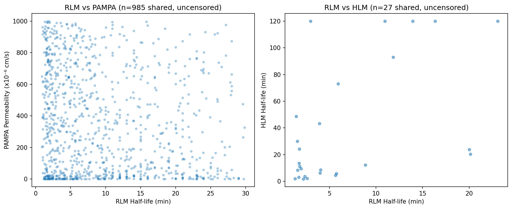
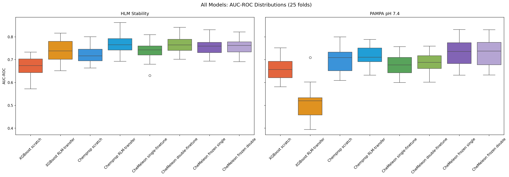

# Transfer Learning for Drug Discovery: NCATS ADME

Demonstration of transfer learning for small-molecule property prediction
using the NCATS ADME dataset. Compares XGBoost (Morgan fingerprints),
Chemprop (D-MPNN), and CheMeleon (D-MPNN foundation model) across related
and unrelated ADME endpoint transfers, with rigorous cross-validation and
statistical testing following the methodology of Pat Walters'
[Practical Cheminformatics](https://practicalcheminformatics.blogspot.com/) blog.

## Dataset

Three NCATS ADME endpoints curated from PubChem BioAssay (public subsets):

| Endpoint | Role | Compounds | Active | Inactive | Class Balance |
|---|---|---|---|---|---|
| RLM Stability | Pre-training source | 2,529 | 754 (stable) | 1,775 (unstable) | 30% / 70% |
| HLM Stability | Related finetune target | 900 | 542 (stable) | 358 (unstable) | 60% / 40% |
| PAMPA pH 7.4 | Unrelated finetune target | 2,033 | 1,738 (permeable) | 295 (impermeable) | 86% / 14% |

**RLM and HLM Stability** both measure microsomal metabolic stability --
the rate at which liver microsome enzymes (predominantly CYP450s) break
down a compound. RLM uses rat liver microsomes, HLM uses human. Although
the specific CYP isoform profiles differ between species, the underlying
biochemistry is the same: compounds with metabolically labile functional
groups (e.g., unprotected amines, benzylic positions, electron-rich
aromatics) tend to be unstable in both species. This shared
structure-activity relationship is why we hypothesize RLM->HLM transfer
should work even though the two datasets share only 5.6% of molecules
and 12.9% of scaffolds -- the *structural rules* governing stability are
conserved across species, even when the specific compounds tested are
different.

**PAMPA pH 7.4** measures passive membrane permeability via an artificial
phospholipid membrane. This is a fundamentally different physical process
from enzymatic metabolism: permeability depends on lipophilicity,
molecular size, hydrogen bond donor/acceptor count, and conformational
flexibility, whereas metabolic stability depends on the presence of
specific metabolically vulnerable functional groups and CYP binding
affinity. A compound can be highly permeable but metabolically unstable
(or vice versa), which is why we hypothesize RLM->PAMPA transfer should
provide minimal benefit -- the structural features that predict one
property are largely orthogonal to those that predict the other.


### Molecule Overlap

| Pair | Shared Molecules | % of Smaller Set | Shared Scaffolds | % of Smaller Set |
|---|---|---|---|---|
| RLM ∩ HLM | 50 | 5.6% | 94 | 12.9% |
| RLM ∩ PAMPA | 2,023 | 99.5% | 1,385 | 99.6% |
| HLM ∩ PAMPA | 41 | 4.6% | 84 | 11.6% |

RLM and PAMPA share 99.5% of molecules (same compound library), making
the RLM->PAMPA transfer a clean test where any benefit must come from
representation learning, not exposure to new chemical matter. HLM has
minimal overlap with either endpoint.

### Continuous Value Distributions


### Correlation of Shared Compounds



RLM vs PAMPA (left) shows no correlation -- mechanistically distinct
endpoints. RLM vs HLM (right) shows a positive trend for the small
number of shared compounds.

### Chemical Space (PaCMAP)

Morgan fingerprints (2048-bit, radius 3) embedded to 2D via PaCMAP.
A single shared embedding across all endpoints.


## Splitting Strategy

Following [Walters' methodology](https://practicalcheminformatics.blogspot.com/2024/11/some-thoughts-on-splitting-chemical.html),
PaCMAP-based clustering splits are used instead of Murcko scaffold
splits:

1. Morgan fingerprints -> PaCMAP 2D embedding
2. KMeans (k=50) clustering in PaCMAP space
3. Cluster assignments as groups for `GroupKFoldShuffle`
4. 5 replicates x 5 folds = 25 train/test splits per experiment
5. Same splits across all model types for paired comparisons

## Models

Six model variants organized along two axes: architecture (XGBoost vs
Chemprop vs CheMeleon) and transfer strategy (scratch vs domain-specific
vs foundation).

| # | Model | Architecture | Params | Transfer Strategy |
|---|---|---|---|---|
| 1 | XGBoost scratch | Gradient-boosted trees | -- | None (Morgan FP 2048-bit r3) |
| 2 | XGBoost RLM-transfer | Gradient-boosted trees | -- | Continue boosting from RLM model |
| 3 | Chemprop scratch | D-MPNN (random init) | 318K | None |
| 4 | Chemprop RLM-transfer | D-MPNN (RLM init) | 318K | Pre-train on RLM, new FFN head |
| 5 | CheMeleon single-finetune | D-MPNN (foundation init) | 9.3M | Foundation -> target |
| 6 | CheMeleon double-finetune | D-MPNN (foundation init) | 9.3M | Foundation -> RLM -> target |

## Results

### Combined Summary (AUC-ROC, 25 folds)

| Target | Model | AUC-ROC (mean +/- std) |
|---|---|---|
| **HLM Stability** | XGBoost scratch | 0.668 +/- 0.046 |
| | XGBoost RLM-transfer | 0.734 +/- 0.046 |
| | Chemprop scratch | 0.721 +/- 0.038 |
| | CheMeleon single-finetune | 0.739 +/- 0.037 |
| | CheMeleon double-finetune | 0.764 +/- 0.038 |
| | **Chemprop RLM-transfer** | **0.768 +/- 0.042** |
| **PAMPA pH 7.4** | XGBoost RLM-transfer | 0.509 +/- 0.069 |
| | XGBoost scratch | 0.659 +/- 0.050 |
| | CheMeleon single-finetune | 0.676 +/- 0.044 |
| | CheMeleon double-finetune | 0.686 +/- 0.044 |
| | Chemprop scratch | 0.701 +/- 0.053 |
| | **Chemprop RLM-transfer** | **0.716 +/- 0.038** |

### Transfer Learning Effect by Architecture

| Target | XGBoost delta | Chemprop delta | CheMeleon single->double delta |
|---|---|---|---|
| HLM (related) | +0.066 | +0.047 | +0.026 |
| PAMPA (unrelated) | **-0.150** | **+0.015** | +0.010 |

### All-Model Comparison




Tukey HSD simultaneous confidence intervals (FWER = 0.05). The reference
model (highest mean AUC-ROC) is highlighted. Groups colored red are
significantly different from the reference. Groups colored gray are not
significantly different from the reference. Non-overlapping intervals
between any two groups indicate a significant difference.

**HLM key pairwise results** (Tukey HSD, FWER = 0.05):
- Chemprop RLM-transfer vs CheMeleon double-finetune: not significant
  (p = 1.00). The top two models are statistically indistinguishable.
- Chemprop RLM-transfer vs Chemprop scratch: significant (p = 0.001).
  Transfer learning helps.
- Chemprop RLM-transfer vs XGBoost scratch: significant (p < 0.001).
  Largest gap.

**PAMPA key pairwise results** (Tukey HSD, FWER = 0.05):
- Chemprop RLM-transfer vs Chemprop scratch: not significant (p = 0.89).
  Transfer provides a small, non-significant improvement on PAMPA.
- Chemprop scratch vs XGBoost scratch: significant (p = 0.049).
  D-MPNN representations outperform Morgan fingerprints.
- XGBoost RLM-transfer vs all other models: significant (p < 0.001).
  The only model that performs catastrophically.

### XGBoost-Only Results


## Discussion

### Why does Chemprop RLM-transfer outperform everything?

Chemprop RLM-transfer is the best model for both HLM (0.768) and PAMPA
(0.716), beating the larger CheMeleon foundation model on both endpoints.
Two factors explain this.

**Right-sized model for the data.** The base Chemprop D-MPNN has 318K
parameters. CheMeleon has 9.3M -- a 29x difference. With ~720 training
samples for HLM and ~1,626 for PAMPA, CheMeleon has a parameter-to-sample
ratio of roughly 13,000:1 (HLM) and 5,700:1 (PAMPA). This is severely
overparameterized. Even with foundation pre-training providing a
reasonable initialization, the model has enough capacity to overfit during
finetuning. The base Chemprop model, at roughly 440:1 (HLM) and 200:1
(PAMPA), is better matched to the data scale.

**Domain-specific pre-training beats generic pre-training for related
tasks.** The RLM pre-training exposes the model to 2,529 compounds with
microsomal stability labels -- the same property family as HLM. This
domain-specific signal is more directly useful than CheMeleon's generic
Mordred descriptor pre-training on 1M PubChem compounds. For HLM, the
RLM-pretrained encoder has already learned "what makes a compound
metabolically stable," and finetuning only needs to adapt from rat to
human metabolism.

### Why does transfer learning work for D-MPNN but not XGBoost?

XGBoost transfer on PAMPA destroys performance (-0.150 AUC, dropping to
near-random 0.509). Chemprop transfer on PAMPA slightly improves it
(+0.015). The difference comes from *where* transfer happens in each
architecture.

**XGBoost transfers at the decision boundary.** When we continue boosting
from an RLM-pretrained XGBoost model, new trees build on top of the
existing RLM decision boundaries. If the target task has similar decision
boundaries (HLM: also microsomal stability), this is helpful. If the
target task has different decision boundaries (PAMPA: membrane
permeability), the existing trees actively mislead the model -- it starts
from a wrong baseline, and the new trees must first undo the RLM
predictions before learning PAMPA patterns. With early stopping, there
may not be enough rounds to recover.

**Chemprop transfers at the representation level.** When we load
RLM-pretrained Chemprop weights and replace the FFN head, the
message-passing encoder retains learned molecular features while the FFN
head is re-initialized from scratch. The encoder features (atom
environments, functional group patterns, ring systems) are general enough
to be useful for any molecular property, even if the specific property is
unrelated. The new FFN head learns the correct mapping from these
features to the target, unconstrained by old decision boundaries.

This is the fundamental advantage of representation-level transfer: the
features generalize even when the task does not.

### Why does CheMeleon underperform random-init Chemprop on PAMPA?

CheMeleon single-finetune (0.676) is worse than Chemprop scratch (0.701)
on PAMPA, and this gap is not statistically significant only because of
high variance. The most likely explanation is overfitting.

With 9.3M parameters and ~1,626 PAMPA training samples, CheMeleon is
extremely overparameterized. The foundation pre-training provides a
reasonable initialization, but 30 epochs of finetuning is enough to
overfit. The smaller Chemprop model (318K params) has less capacity to
memorize noise and generalizes better.

The CheMeleon double-finetune partially recovers (0.686 vs 0.676 for
single), suggesting the intermediate RLM finetuning step provides some
regularization by steering the model toward a drug-discovery-relevant
region of weight space before task-specific finetuning. But it is still
not enough to overcome the capacity mismatch.

### Frozen encoder experiment: testing the overfitting hypothesis

To test whether CheMeleon's underperformance is due to overfitting the
encoder, we froze the 8.7M-parameter BondMessagePassing layer and trained
only the FFN head (~615K params). If the foundation representations are
good enough and the full-finetune models were overfitting, the frozen
variants should improve.

| Target | Model | AUC-ROC (mean +/- std) |
|---|---|---|
| **HLM** | CheMeleon single-finetune (unfrozen) | 0.739 +/- 0.037 |
| | CheMeleon double-finetune (unfrozen) | 0.764 +/- 0.038 |
| | CheMeleon frozen single | 0.755 +/- 0.034 |
| | CheMeleon frozen double | 0.756 +/- 0.034 |
| **PAMPA** | CheMeleon single-finetune (unfrozen) | 0.676 +/- 0.044 |
| | CheMeleon double-finetune (unfrozen) | 0.686 +/- 0.044 |
| | **CheMeleon frozen single** | **0.730 +/- 0.055** |
| | **CheMeleon frozen double** | **0.730 +/- 0.056** |


**HLM**: No significant differences between any frozen/unfrozen variant
(Tukey HSD, all p > 0.06). The encoder adaptation during full finetuning
neither helps nor hurts for the related endpoint. The CheMeleon
representations are already reasonable for microsomal stability
prediction, and the FFN head has enough capacity to learn the mapping
regardless of whether the encoder is tuned.

**PAMPA**: Freezing significantly improves performance. Frozen single
(0.730) outperforms unfrozen single (0.676) by +0.054 AUC (p = 0.001).
Frozen double (0.730) outperforms unfrozen double (0.686) by +0.044 AUC
(p = 0.013). This confirms the overfitting hypothesis for the unrelated
endpoint: when the target task is dissimilar from the pre-training
objective, unrestricted finetuning of the large encoder destroys the
general representations. Freezing prevents this degradation.

Notably, the frozen CheMeleon models (0.730) now outperform Chemprop
RLM-transfer (0.716) on PAMPA, though this difference was not tested
for significance in the frozen-only comparison. The frozen CheMeleon
representations -- learned from 1M PubChem compounds predicting Mordred
descriptors -- appear to be genuinely useful general molecular features,
but only when the model is prevented from overwriting them during
finetuning on a small dataset.

### Key takeaway

On this dataset and at this scale (~900-2,500 compounds per endpoint):

- Transfer learning from a mechanistically related endpoint (RLM->HLM)
  improved all architectures tested. The benefit was present even with
  only 5.6% molecule overlap between source and target, suggesting the
  models learn transferable structural rules rather than memorizing
  specific compounds.
- Transfer learning from a mechanistically unrelated endpoint (RLM->PAMPA)
  was catastrophic for XGBoost (-0.150 AUC), harmless-to-slightly-helpful
  for Chemprop (+0.015), and marginally helpful for CheMeleon (+0.010).
  The D-MPNN architectures were more robust to irrelevant pre-training
  than the tree ensemble.
- The 9.3M-parameter CheMeleon foundation model underperformed the
  318K-parameter Chemprop model when fully finetuned. The frozen-encoder
  experiment confirmed this was due to overfitting: freezing the encoder
  and training only the FFN head improved PAMPA AUC by +0.054 (p = 0.001),
  and the frozen CheMeleon became the best PAMPA model overall (0.730).
  For HLM, freezing made no significant difference -- the encoder
  representations were already adequate for the related task.

These results are specific to the NCATS ADME public subsets and the
particular model configurations tested. Different dataset sizes, endpoint
types, hyperparameter choices, or pre-training strategies could yield
different rankings.

## Project Structure

```
xfer-learning/
  pyproject.toml                       # UV project config
  notebooks/
    01-data-acquisition.py             # Marimo: download + curate NCATS data
    02-eda.py                          # Marimo: EDA, splits, fold quality
    03-train-baselines.py              # Marimo: XGBoost baselines
    04-train-chemprop.py               # Marimo: Chemprop results visualization
    05-chemeleon.py                    # Marimo: CheMeleon + combined comparison
    06-analysis.py                     # Marimo: final analysis and discussion
    07-chemeleon-frozen.py             # Marimo: frozen encoder comparison
  scripts/
    run-chemprop-training.py           # Chemprop CV training with disk caching
    run-chemeleon-training.py          # CheMeleon CV training with disk caching
    run-chemeleon-frozen-training.py   # CheMeleon frozen encoder training
  src/xfer_learning/                   # Package (placeholder)
  data/                                # Downloaded/processed data (gitignored)
  docs/
    initial-plan.md                    # Experiment design document
    figures/                           # Exported plots
```

## Running

```bash
# Install dependencies
uv sync

# Run notebooks interactively (in order)
uv run marimo edit notebooks/01-data-acquisition.py
uv run marimo edit notebooks/02-eda.py
uv run marimo edit notebooks/03-train-baselines.py

# Run training scripts (standalone, with per-fold caching)
uv run python scripts/run-chemprop-training.py
uv run python scripts/run-chemeleon-training.py
uv run python scripts/run-chemeleon-frozen-training.py

# View results
uv run marimo edit notebooks/04-train-chemprop.py
uv run marimo edit notebooks/05-chemeleon.py
uv run marimo edit notebooks/06-analysis.py
uv run marimo edit notebooks/07-chemeleon-frozen.py
```

## References

- Walters, P. [Some Thoughts on Splitting Chemical Datasets](https://practicalcheminformatics.blogspot.com/2024/11/some-thoughts-on-splitting-chemical.html). Practical Cheminformatics, 2024.
- Walters, P. [Even More Thoughts on ML Method Comparison](https://practicalcheminformatics.blogspot.com/2025/03/even-more-thoughts-on-ml-method.html). Practical Cheminformatics, 2025.
- Chemprop: [github.com/chemprop/chemprop](https://github.com/chemprop/chemprop)
- CheMeleon: [github.com/JacksonBurns/chemeleon](https://github.com/JacksonBurns/chemeleon) / [Zenodo](https://zenodo.org/records/15460715)
- NCATS ADME: [opendata.ncats.nih.gov/adme](https://opendata.ncats.nih.gov/adme)
