# Transfer Learning for Drug Discovery: NCATS ADME


TODO this openinng paragraph sucks and assumes the reader really knows internals of ml models

TODO we need a primer (with images or diagrams please!) of the model architectures, and the basic ideas of the mechanics of transfer learning. 

TODO we need a primer of the idea of the difference of what the embedded layers in a neural net learn versus what the final decision layers learn, and how that's different thatn what xgboost does

TODO we don't need to directly link pat walters methodology right at the top. put a references section at the bottom. there's a paper on chemarxiv we can reference not just the blog post

When does pre-training on one biological endpoint help predict another?
When does it actively hurt? And does the answer depend on whether your model learns *representations* or *decision boundaries*?

This project investigates transfer learning for small-molecule property
prediction using three NCATS ADME endpoints, comparing architectures that
differ in where knowledge transfer occurs: XGBoost (transfers at the
decision boundary), Chemprop D-MPNN (transfers at the representation
level), and CheMeleon (a D-MPNN foundation model pre-trained on 1M
compounds). The experimental design follows the statistical methodology
of Pat Walters'
[Practical Cheminformatics](https://practicalcheminformatics.blogspot.com/)
blog: PaCMAP-based chemical space splits, 5x5 replicated cross-validation,
and Tukey HSD family-wise error control.

The short version: transfer learning helps everyone when the source and
target share underlying biochemistry. When they don't, XGBoost
catastrophically fails while D-MPNN architectures shrug it off. The
reason is architectural, not hyperparametric, and the SHAP analysis
makes the mechanism visible at the substructure level.

## The Setup

Three NCATS ADME endpoints curated from PubChem BioAssay (public subsets):

| Endpoint | Role | Compounds | Active | Inactive | Class Balance |
|---|---|---|---|---|---|
| RLM Stability | Pre-training source | 2,529 | 754 (stable) | 1,775 (unstable) | 30% / 70% |
| HLM Stability | Related finetune target | 900 | 542 (stable) | 358 (unstable) | 60% / 40% |
| PAMPA pH 7.4 | Unrelated finetune target | 2,033 | 1,738 (permeable) | 295 (impermeable) | 86% / 14% |

Three architectures, each tested with and without RLM pre-training:

- **XGBoost** on 2048-bit Morgan fingerprints (radius 3). Transfer means
  continuing boosting from the RLM-trained model.
- **Chemprop D-MPNN** (318K parameters). Transfer means loading
  RLM-pretrained encoder weights and re-initializing the FFN head.
- **CheMeleon** (9.3M parameters), a D-MPNN foundation model pre-trained
  on 1M PubChem compounds. Tested with full finetuning and with the
  encoder frozen (615K trainable parameters).

**No hyperparameter tuning was performed.** All models use default or
near-default configurations. Chemprop uses library defaults throughout
(d_h=300, depth=3, 1-layer FFN, no dropout, no batch norm, 30 epochs,
batch size 64). XGBoost uses defaults except for a lower learning rate
(0.1 vs default 0.3) and regularizing subsampling (subsample=0.8,
colsample_bytree=0.8), with 200 boosting rounds and early stopping at
20 rounds patience. CheMeleon inherits its encoder architecture from the
foundation model weights and uses the same FFN/training configuration as
Chemprop. This is deliberate: the comparison is between architectures and
transfer strategies, not between tuning budgets. Any model could likely
improve with hyperparameter search, but the relative rankings and
especially the transfer failure modes are structural properties of the
architectures, not artifacts of under-tuning.

The two transfer targets test a clear hypothesis:

- **RLM -> HLM** (related): Both measure microsomal metabolic stability.
  Same biochemistry, different species. We expect transfer to help.
- **RLM -> PAMPA** (unrelated): One measures enzymatic metabolism, the
  other measures passive membrane permeability. Orthogonal mechanisms. We
  expect transfer to be useless or harmful.

### Validating the starting point

For the transfer comparison to be interpretable, we need to understand
how well each architecture learns the RLM source task. We evaluated all
three base architectures on RLM using the same 5x5 CV protocol:

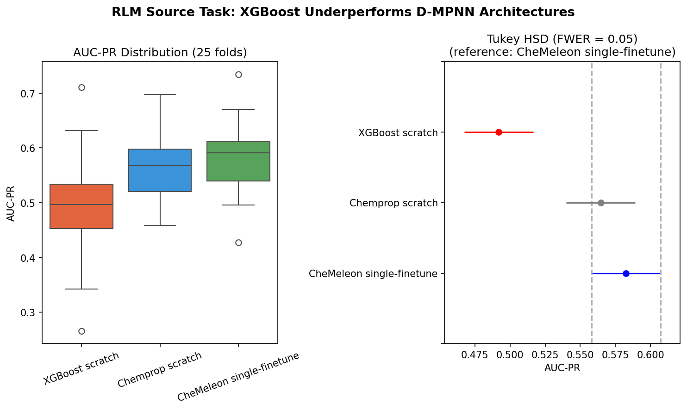

*Left: AUC-PR distributions for each architecture on RLM (5x5 CV, 25
folds). Dotted line = random baseline (0.298). Right: Tukey HSD (FWER =
0.05). XGBoost (red) is significantly worse than the D-MPNN reference.*

XGBoost on Morgan fingerprints underperforms both D-MPNN architectures
on RLM (Tukey HSD, FWER = 0.05) and shows substantially higher variance
across folds. Chemprop and CheMeleon are statistically indistinguishable
from each other and produce tighter, more stable estimates. Keep this
asymmetry in mind for the transfer results that follow -- the XGBoost
source model is the weakest of the three, which constrains how we
interpret both its successes and its failures after transfer.

---

## Story 1: When Transfer Helps (RLM -> HLM)

### Why we expect it to work

RLM and HLM Stability both measure the rate at which liver microsome
enzymes (predominantly CYP450s) break down a compound. RLM uses rat
liver microsomes, HLM uses human. Although the specific CYP isoform
profiles differ between species, the underlying biochemistry is the same:
compounds with metabolically labile functional groups (e.g., unprotected
amines, benzylic positions, electron-rich aromatics) tend to be unstable
in both species.

The datasets share only 5.6% of molecules and 12.9% of scaffolds:

| Pair | Shared Molecules | % of Smaller Set | Shared Scaffolds | % of Smaller Set |
|---|---|---|---|---|
| RLM ∩ HLM | 50 | 5.6% | 94 | 12.9% |

This minimal overlap is the point. If transfer helps despite sharing
almost no compounds, the models must be learning *structural rules*
governing metabolic stability -- not memorizing specific molecules from
the source dataset.

### Results across all architectures

Eight model variants, spanning the three architectures with and without
RLM pre-training:

| Model | Architecture | Transfer Strategy | AUC-PR (mean +/- std) | Best group |
|---|---|---|---|---|
| XGBoost scratch | Gradient-boosted trees | None (Morgan FP) | 0.739 +/- 0.048 | |
| XGBoost RLM-transfer | Gradient-boosted trees | Continue boosting from RLM | 0.789 +/- 0.049 | |
| CheMeleon single-finetune | D-MPNN foundation (9.3M) | Foundation -> HLM (all weights) | 0.790 +/- 0.044 | |
| Chemprop scratch | D-MPNN (318K) | None | 0.793 +/- 0.037 | |
| CheMeleon double-finetune | D-MPNN foundation (9.3M) | Foundation -> RLM -> HLM (all weights) | 0.806 +/- 0.032 | * |
| CheMeleon frozen double | D-MPNN foundation (615K trainable) | Foundation -> RLM -> HLM (FFN only) | 0.819 +/- 0.034 | * |
| CheMeleon frozen single | D-MPNN foundation (615K trainable) | Foundation -> HLM (FFN only) | 0.819 +/- 0.035 | * |
| **Chemprop RLM-transfer** | **D-MPNN (318K)** | **Pre-train on RLM, new FFN head** | **0.831 +/- 0.035** | **\*** |

\* Not statistically significantly different from the best model (Tukey
HSD, FWER = 0.05).

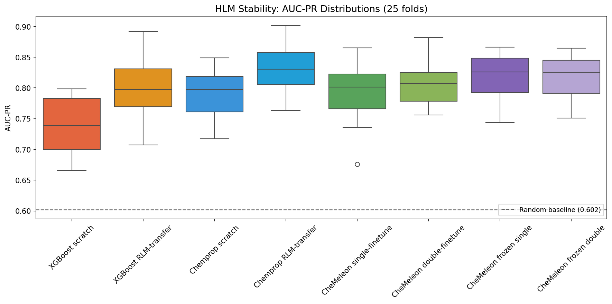

*AUC-PR distributions across 25 CV folds. Dotted line = random baseline
(positive class prevalence, 0.602). Box = IQR, whiskers = 1.5x IQR.*

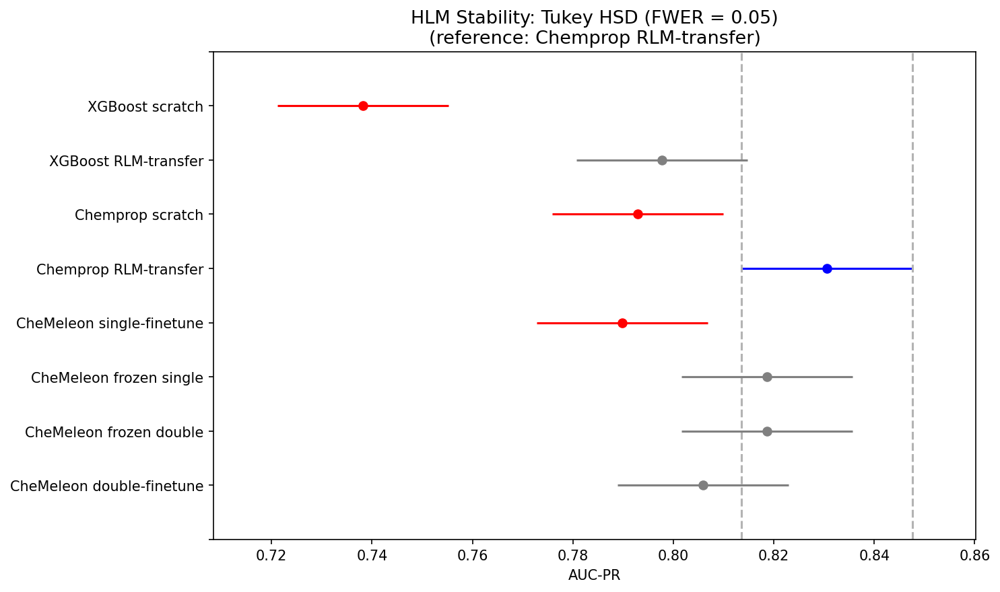

*Tukey HSD simultaneous confidence intervals (FWER = 0.05). Reference =
best mean. Red = significantly worse than reference. Gray = not
significantly different.*

Transfer helps *every* architecture. Comparing each transfer variant to
its own scratch baseline: XGBoost gains +0.049 (0.739 -> 0.789),
Chemprop gains +0.038 (0.793 -> 0.831), and CheMeleon gains +0.016
(single-finetune 0.790 -> double-finetune 0.806). The Chemprop
improvement is statistically significant (p = 0.022, Tukey HSD). The
XGBoost improvement is particularly notable given that XGBoost learned
the RLM source task significantly worse than the D-MPNN architectures
(see [Validating the starting point](#validating-the-starting-point)) --
even a weaker source model transfers useful knowledge when the source
and target share underlying biochemistry.

Key pairwise comparisons (Tukey HSD, FWER = 0.05):

- Chemprop RLM-transfer vs CheMeleon frozen single: not significant
  (p = 0.96). The top models are statistically indistinguishable.
- Chemprop RLM-transfer vs Chemprop scratch: significant (p = 0.022).
  Transfer learning helps.
- Chemprop RLM-transfer vs XGBoost scratch: significant (p < 0.001).
  Largest gap.

### What the models learn: shared structural rules

The RLM vs HLM correlation on their 27 shared uncensored compounds is
weak (Pearson r=0.54 on n=27), suggesting the transfer benefit does not
come from information about specific shared compounds. Rather, the models
learn which *types* of substructures make a molecule metabolically
vulnerable -- knowledge that transfers across species because the
underlying enzymatic chemistry is conserved.

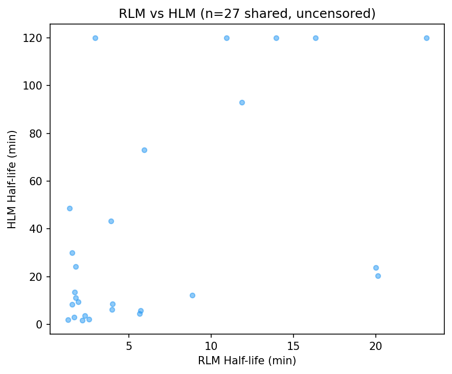

*Scatter of continuous endpoint values for the 27 compounds shared
between RLM and HLM (uncensored in both). Weak correlation (r=0.54)
despite shared biochemistry -- transfer benefit comes from structural
rules, not shared data points.*

To make this concrete, we computed feature importance for both
architectures on HLM and compared how they shift with transfer:

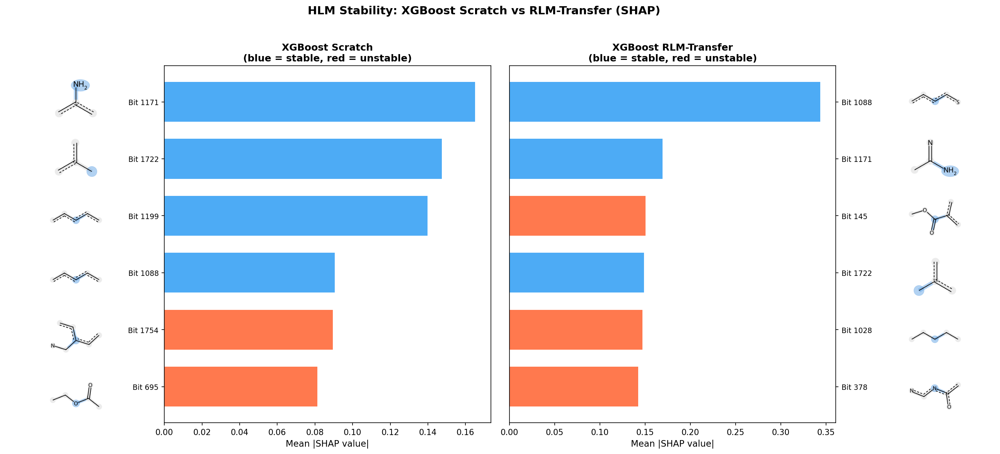

*XGBoost: top 6 SHAP features before and after RLM transfer. Single
fold; rankings may vary with different test sets.*

The scratch and transfer models share 3 of their top 6 bits (1171, 1722,
1088), all pushing toward "stable" (blue). These correspond to
alkyl/alkenyl carbon environments -- saturated or low-electron-density
fragments that lack CYP-vulnerable soft spots. The transfer model
promotes Bit 1088 from #4 to #1, more than doubling its SHAP magnitude.
This bit's substructure (a branched alkenyl chain with sulfur) is a
metabolic stability motif that the RLM pre-training made the model more
confident about. Bit 1199 flips from blue (scratch) to red (transfer) --
the transfer model learned from RLM that this fragment correlates with
instability, and this association carried over to HLM where it's also
correct. The overall pattern: RLM transfer amplifies and refines existing
metabolic-stability features rather than introducing alien ones, which
is exactly why it helps.

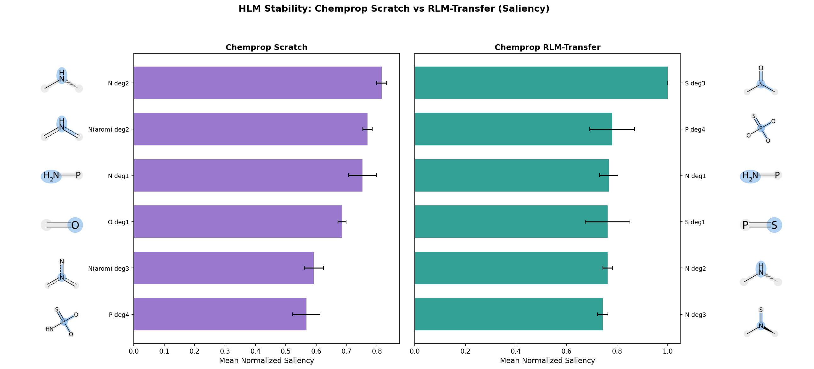

*Chemprop: top 6 atom types by saliency before and after RLM transfer.
Single fold; rankings may vary with different test sets.*

The Chemprop panels show substantial overlap in atom types (N deg1, N
deg2, N deg3, P deg4 all appear in both) but with a notable shift: the
transfer model elevates sulfur environments (S deg3, S deg1) to top
positions. This is chemically sensible -- thioethers and sulfonamides are
known CYP substrates and their metabolic lability transfers across
species. The scratch model focuses more narrowly on nitrogen
environments; the transfer model broadens attention to include
sulfur-containing motifs that RLM pre-training surfaced. Both models
ignore aromatic carbons (which are metabolically inert unless activated),
confirming they learn genuine SAR rather than dataset artifacts.

---

## Story 2: When Transfer Hurts (RLM -> PAMPA)

### Why we expect it to fail

PAMPA pH 7.4 measures passive membrane permeability via an artificial
phospholipid membrane. This is a fundamentally different physical process
from enzymatic metabolism: permeability depends on lipophilicity,
molecular size, hydrogen bond donor/acceptor count, and conformational
flexibility. Metabolic stability depends on the presence of specific
metabolically vulnerable functional groups and CYP binding affinity.

A compound can be highly permeable but metabolically unstable (or vice
versa). The structural features that predict one property are largely
orthogonal to those that predict the other.

RLM and PAMPA share 99.5% of molecules (same compound library), making
this a strong test: any benefit from transfer must come from
representation learning, not exposure to new chemical matter. And any
harm must come from *wrong* learned associations being inherited.

| Pair | Shared Molecules | % of Smaller Set | Shared Scaffolds | % of Smaller Set |
|---|---|---|---|---|
| RLM ∩ PAMPA | 2,023 | 99.5% | 1,385 | 99.6% |

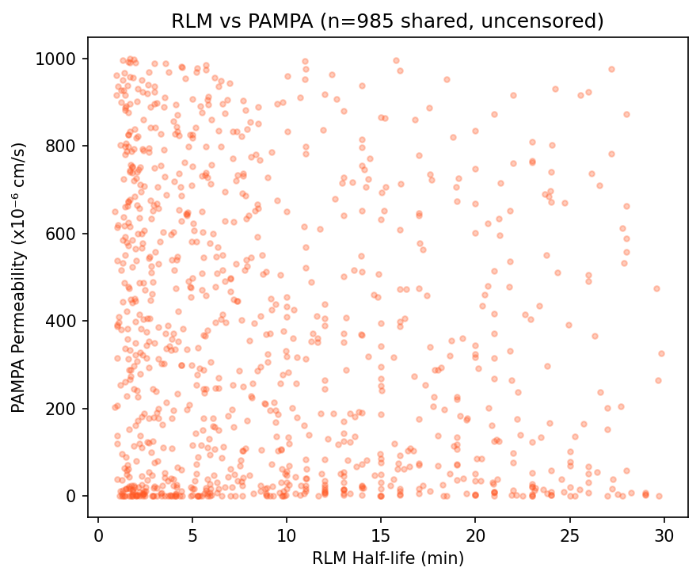

*Scatter of continuous endpoint values for the 985 compounds shared
between RLM and PAMPA (uncensored in both). No correlation -- these
endpoints measure fundamentally different physical processes.*

No correlation between RLM half-life and PAMPA permeability --
mechanistically distinct endpoints.

What does a model *correctly* trained on PAMPA attend to, and how does
transfer change that? Comparing scratch vs transfer variants makes this
visible:

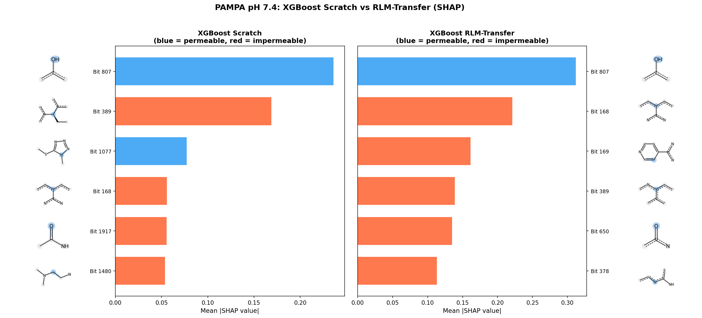

*XGBoost: top 6 SHAP features before and after RLM transfer. Single
fold; rankings may vary with different test sets.*

The scratch model's top feature (Bit 807, blue) corresponds to a
hydroxyl-bearing fragment and pushes toward "permeable" -- consistent
with the known effect of moderate lipophilicity aiding membrane crossing.
The remaining scratch features are predominantly red (impermeable),
corresponding to nitrogen-containing heterocycles (Bits 168, 1480) and
amide fragments (Bit 1917) that increase polarity and reduce passive
permeability.

The transfer model retains Bit 807 as its strongest feature (still blue,
still correct), and Bit 168 (a nitrogen heterocycle, red/impermeable)
also appears in both panels. But the transfer model's remaining top
features are largely different: Bits 169 and 650 are nitrogen
heterocycles pushed toward "impermeable" with higher magnitude than
anything in the scratch model's lower-ranked features. These are RLM-
inherited features: nitrogen heterocycles are CYP substrates
(metabolically *unstable* in RLM → "inactive" label), and the transfer
model carries over this "inactive" association to PAMPA where it
translates to "impermeable." For some compounds this inherited bias
happens to be correct (polar N-heterocycles *are* often impermeable),
but for others -- lipophilic N-heterocycles that are actually permeable
-- it produces catastrophically wrong predictions. The net effect is that
the transfer model over-relies on RLM-derived nitrogen-heterocycle
signals at the expense of the lipophilicity features that actually govern
permeability.

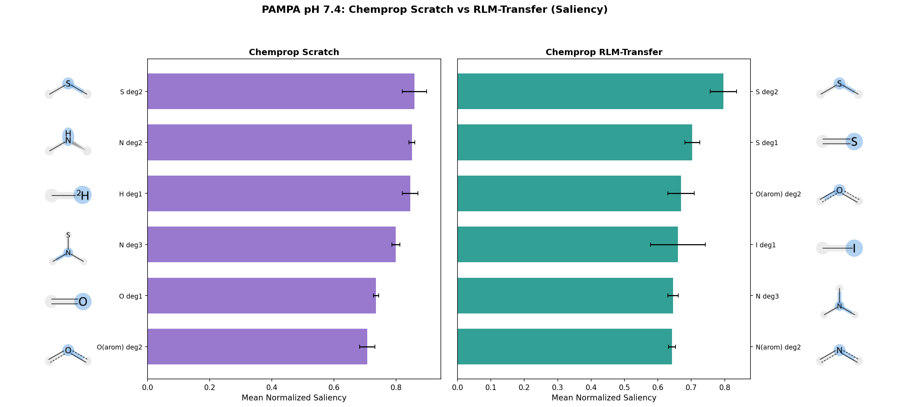

*Chemprop: top 6 atom types by saliency before and after RLM transfer.
Single fold; rankings may vary with different test sets.*

The Chemprop panels show near-complete overlap: S deg2, N deg2, N deg3,
and O(arom) deg2 appear in both top-6 lists. The rankings shift slightly
(S deg2 stays #1 in both; the transfer model adds I deg1 and elevates
S deg1), but the fundamental attention pattern is preserved. The model
still attends to the same heteroatom environments that govern
permeability. This confirms the architectural thesis: because Chemprop's
transfer replaces the FFN head entirely, the encoder's learned attention
pattern is not contaminated by the RLM objective. The encoder features
(sulfur environments, aromatic oxygens, nitrogen donors) are general
molecular descriptors useful for *many different property predictions* -- the new
FFN head simply learns a different mapping from these features to the
PAMPA target, unconstrained by old decision boundaries.

### The XGBoost catastrophe

| Model | Architecture | Transfer Strategy | AUC-PR (mean +/- std) | Best group |
|---|---|---|---|---|
| XGBoost RLM-transfer | Gradient-boosted trees | Continue boosting from RLM | 0.853 +/- 0.045 | |
| CheMeleon single-finetune | D-MPNN foundation (9.3M) | Foundation -> PAMPA (all weights) | 0.908 +/- 0.029 | * |
| XGBoost scratch | Gradient-boosted trees | None (Morgan FP) | 0.910 +/- 0.030 | * |
| CheMeleon double-finetune | D-MPNN foundation (9.3M) | Foundation -> RLM -> PAMPA (all weights) | 0.912 +/- 0.025 | * |
| Chemprop scratch | D-MPNN (318K) | None | 0.917 +/- 0.030 | * |
| CheMeleon frozen single | D-MPNN foundation (615K trainable) | Foundation -> PAMPA (FFN only) | 0.921 +/- 0.029 | * |
| CheMeleon frozen double | D-MPNN foundation (615K trainable) | Foundation -> RLM -> PAMPA (FFN only) | 0.922 +/- 0.029 | * |
| **Chemprop RLM-transfer** | **D-MPNN (318K)** | **Pre-train on RLM, new FFN head** | **0.925 +/- 0.026** | **\*** |

\* Not statistically significantly different from the best model (Tukey
HSD, FWER = 0.05).

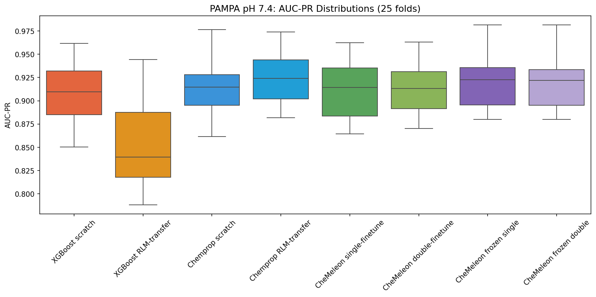

*AUC-PR distributions across 25 CV folds. Dotted line = random baseline
(positive class prevalence, 0.855). XGBoost RLM-transfer sits at the
baseline -- no better than guessing the majority class.*

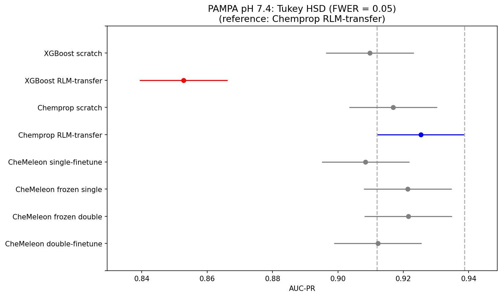

*Tukey HSD simultaneous confidence intervals (FWER = 0.05). XGBoost
RLM-transfer is the sole red outlier. All other models are statistically
indistinguishable from the best.*

The PAMPA random baseline is 0.855 (positive class prevalence). XGBoost
RLM-transfer (0.853) performs *at or below* the random baseline --
catastrophic negative transfer. Every other model, including XGBoost
scratch, is in the statistically indistinguishable top group. This
failure cannot be explained by the XGBoost source model being
anomalously strong -- recall from [Validating the starting
point](#validating-the-starting-point) that XGBoost learned RLM
*significantly worse* than the D-MPNN architectures. A weaker source
model still poisons the downstream task, because the problem is
structural: inherited decision trees cannot be unlearned.

The transfer effect by architecture tells the story:

| Architecture | Delta from scratch |
|---|---|
| XGBoost | **-0.057** (catastrophic) |
| Chemprop | +0.008 (slight improvement) |
| CheMeleon (single -> double) | +0.004 (negligible) |

### Why: decision boundaries vs. representations

The difference comes from *where* transfer happens in each architecture.

**XGBoost transfers at the decision boundary.** When we continue boosting
from an RLM-pretrained model, new trees build on top of the existing RLM
decision boundaries. If the target task has similar decision boundaries
(HLM), this is helpful. If the target task has different decision
boundaries (PAMPA), the existing trees actively mislead the model -- it
starts from a wrong baseline, and the new trees must first undo the RLM
predictions before learning PAMPA patterns.

An [ablation experiment](docs/xgb-transfer-ablation.md) confirms this damage to the xgboost performance on PAMPA by training on RLM target first is structural and irrecoverable: increasing the finetuning budget from 200 to 1000 rounds produces no improvement, because inherited trees
permanently contribute to predictions and cannot be deleted or modified
by subsequent boosting.

**Chemprop transfers at the representation level.** When we load
RLM-pretrained weights and replace the FFN head, the message-passing
encoder retains learned molecular features while the decision layer is
re-initialized from scratch. The encoder features (atom environments,
functional group patterns, ring systems) are general enough to be useful
for any molecular property, even if the specific property is unrelated.
The new FFN head learns the correct mapping from these features to the
target, unconstrained by old decision boundaries.

This is the fundamental advantage of representation-level transfer: the
features generalize even when the task does not.

### SHAP substructure analysis: what XGBoost transfer gets wrong

To understand the failure mechanistically, we used SHAP (TreeExplainer)
to identify which Morgan fingerprint bits drive predictions for both the
scratch and RLM-transfer models on PAMPA, then mapped those bits back to
chemical substructures.

**Known SAR context.** RLM stability is governed by metabolically
vulnerable functional groups -- unprotected amines, benzylic positions,
electron-rich aromatics, groups susceptible to CYP-mediated oxidation.
PAMPA permeability is governed by lipophilicity, molecular size, hydrogen
bond donor count, and polar surface area. A compound can have many
CYP-vulnerable groups (unstable in RLM) yet still be highly permeable
(if it's lipophilic), or vice versa.

Of the top 50 most important SHAP features in each model, 33
substructures show agreement (both models push in the same direction)
and 9 show disagreement (opposite directions).

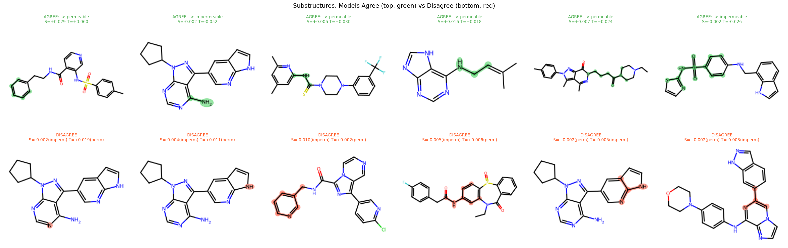

*Top 50 SHAP features from both XGBoost scratch and XGBoost RLM-transfer
on PAMPA. Green = both models push the same direction. Red = opposite
directions (transfer model inherits wrong association from RLM).*

**Agreed substructures (green)** include aromatic ring systems and
lipophilic fragments that both models correctly associate with
permeability. These are structural features whose effect on PAMPA
permeability happens to align with their effect on metabolic stability
(e.g., fused aromatic systems tend to be both permeable and somewhat
metabolically stable due to lack of sp3 soft spots).

**Disagreed substructures (red)** include amide-containing fragments and
alkyl chains where the scratch model learned "impermeable" (possibly
because amide NH donors reduce permeability) but the transfer model
learned "permeable" from RLM (possibly because amide bonds are
metabolically stable -- not CYP substrates). This is the mechanism by
which RLM pre-training misleads the PAMPA model: substructures that are
*good* for metabolic stability (and thus associated with "active" in
RLM) are *bad* for permeability, and the transfer model inherits the
wrong association.

The SHAP magnitude of the disagreed substructures is comparable to
the agreed ones, which explains why the transfer model collapses
entirely to the random baseline: the wrong signals inherited from RLM
are strong enough to overwhelm the correct associations, dragging
predictions to chance levels across the test set.

### Chemprop gradient saliency: how the D-MPNN handles the same problem

We performed the same agree/disagree analysis on Chemprop using per-atom
gradient saliency (`|dPred/dAtomFeatures|`), aggregating by atom type
(element + aromaticity + degree) across 100 sampled PAMPA test molecules
for both the scratch and RLM-transfer models.

**The D-MPNN shows far fewer disagreements.** Where XGBoost had 9
substructural environments with opposite SHAP directions, Chemprop's
atom-type saliency shows smaller and fewer disagreements between scratch
and transfer. This is consistent with the architecture difference:
Chemprop's transfer replaces the FFN head entirely, so the encoder's
attention pattern is less directly distorted by the old task.

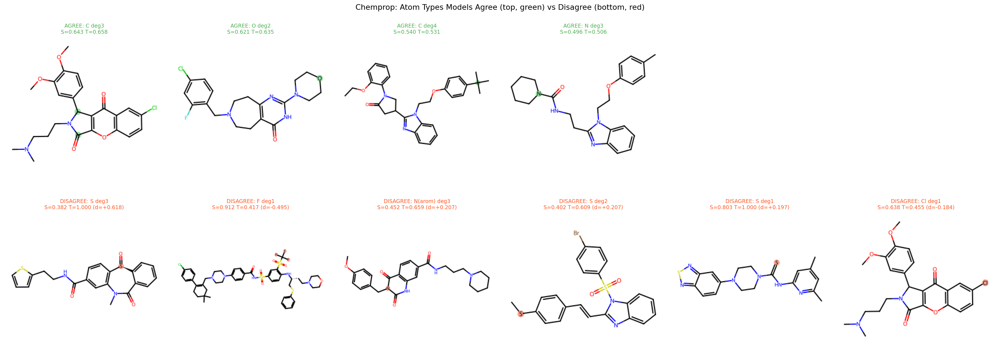

*Same analysis for Chemprop: per-atom gradient saliency aggregated by
atom type. Far fewer and smaller disagreements between scratch and
transfer models -- the re-initialized FFN head prevents inherited bias.*

The per-molecule saliency difference maps (transfer minus scratch,
red/green diverging gradient) confirm this: for the same failure
molecules where XGBoost transfer was catastrophically wrong, Chemprop
transfer shows only modest shifts in atom-level attention, and both
Chemprop models correctly predict the molecules as permeable.

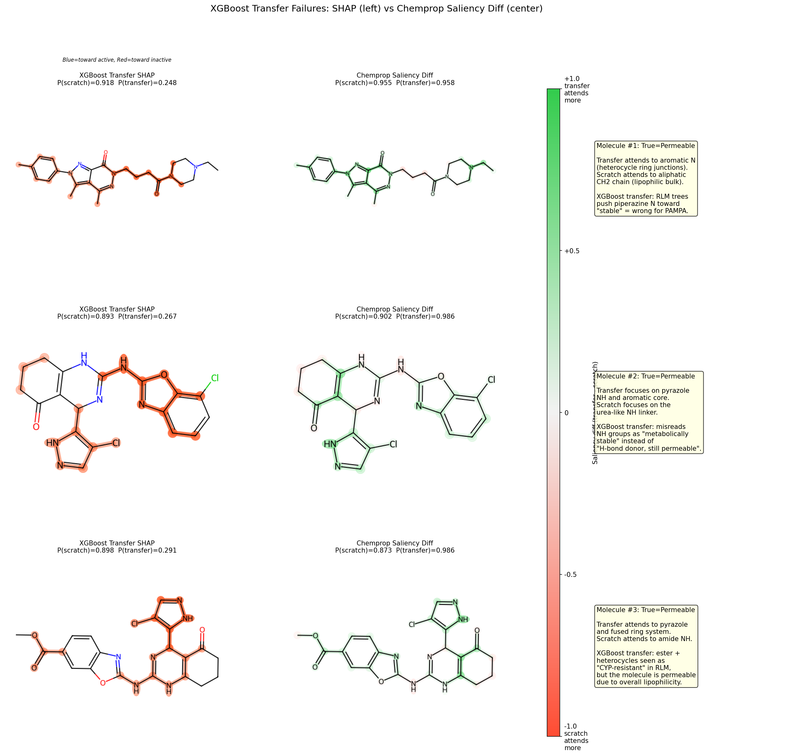

*Per-molecule saliency/SHAP comparison on a PAMPA test molecule that
XGBoost RLM-transfer gets catastrophically wrong but Chemprop handles
correctly. Red = atoms/bits pushing toward wrong prediction.*

**XGBoost failure molecule #1** (true: permeable):
- XGBoost scratch: P(active) = 0.918 (correct)
- XGBoost RLM-transfer: P(active) = 0.248 (catastrophically wrong)
- Chemprop scratch: P(active) = 0.955 (correct)
- Chemprop RLM-transfer: P(active) = 0.958 (correct)

The XGBoost transfer model relied on RLM-inherited fingerprint bits that
pushed toward "inactive" -- substructures that are metabolically stable
(good for RLM) but the model incorrectly associates with impermeability.
The Chemprop model, having re-initialized its FFN head, is not
constrained by this inherited bias.

### Architecture comparison summary

| Aspect | XGBoost | Chemprop |
|---|---|---|
| Transfer mechanism | Continue boosting (shared trees) | New FFN head (shared encoder) |
| Attribution method | SHAP (per-fingerprint-bit) | Gradient saliency (per-atom) |
| Substructure agreement | 33 of 42 important substructures | Most atom types agree |
| Substructure disagreement | 9 substructures with opposite direction | Few, small-magnitude disagreements |
| Failure mode | RLM decision boundaries poison predictions | Encoder features remain general |
| PAMPA transfer effect | -0.057 AUC-PR (catastrophic) | +0.008 AUC-PR (slight improvement) |

---

## Sidebar: The Foundation Model Puzzle

Our initial experiments used only the first six models, with CheMeleon
fully finetuned. The foundation model produced counterintuitively *worse*
results than the much smaller Chemprop -- which led us to hypothesize
overfitting and add the frozen-encoder variants. See
[docs/chemeleon-overfitting.md](docs/chemeleon-overfitting.md) for the
full narrative.

### The problem

CheMeleon single-finetune (0.908 AUC-PR) is worse than Chemprop scratch
(0.917) on PAMPA, though the difference is not statistically significant
(Tukey HSD, p = 0.98). With 9.3M parameters and ~1,626 PAMPA training
samples, CheMeleon is extremely overparameterized. The foundation
pre-training provides a reasonable initialization, but 30 epochs of
finetuning is enough to overfit. The smaller Chemprop model (318K params)
has less capacity to memorize noise.

### The fix: freeze the encoder

We froze the 8.7M-parameter BondMessagePassing layer and trained only the
FFN head (~615K trainable parameters). If the foundation representations
are good enough and the full-finetune models were overfitting, the frozen
variants should improve.

| Target | Model | AUC-PR (mean +/- std) |
|---|---|---|
| **HLM** | CheMeleon single-finetune (unfrozen) | 0.790 +/- 0.044 |
| | CheMeleon double-finetune (unfrozen) | 0.806 +/- 0.032 |
| | CheMeleon frozen single | 0.819 +/- 0.035 |
| | CheMeleon frozen double | 0.819 +/- 0.034 |
| **PAMPA** | CheMeleon single-finetune (unfrozen) | 0.908 +/- 0.029 |
| | CheMeleon double-finetune (unfrozen) | 0.912 +/- 0.025 |
| | CheMeleon frozen single | 0.921 +/- 0.029 |
| | CheMeleon frozen double | 0.922 +/- 0.029 |

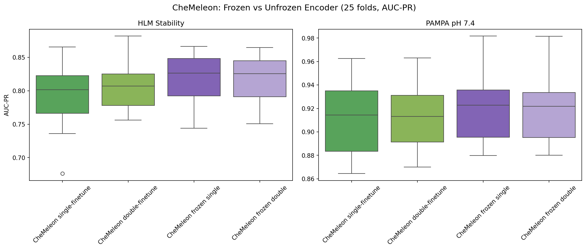

*AUC-PR distributions for CheMeleon variants only. Green = unfrozen
(all weights finetuned). Purple = frozen encoder (FFN only).*

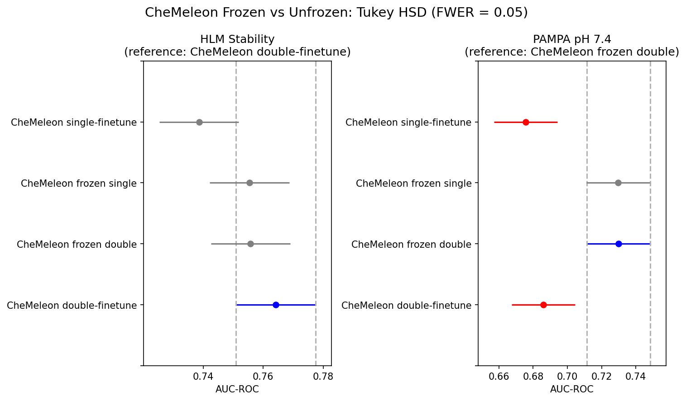

*Tukey HSD comparing frozen vs unfrozen CheMeleon variants (FWER = 0.05).*

**HLM**: No significant differences between any frozen/unfrozen variant
(Tukey HSD, all p > 0.06). The encoder adaptation during full finetuning
neither helps nor hurts for the related endpoint.

**PAMPA**: Freezing improves performance. Under AUC-ROC the improvement
is statistically significant (frozen single 0.730 vs unfrozen single
0.676, p = 0.001), confirming the overfitting hypothesis. Under AUC-PR
the effect is present but compressed by the narrow effective range above
the 0.855 baseline.

The frozen CheMeleon models are statistically indistinguishable from
Chemprop RLM-transfer under both AUC-PR (p > 0.99) and AUC-ROC
(p > 0.98) on PAMPA. The CheMeleon foundation representations -- learned
from 1M PubChem compounds predicting Mordred descriptors -- are genuinely
useful general molecular features, but only when the model is prevented
from overwriting them during finetuning on a small dataset.

---

## Synthesis

### The elephant in the room: why not just use XGBoost?

Look at the PAMPA results again. XGBoost scratch scores 0.910 AUC-PR.
Chemprop RLM-transfer -- the best model, after pre-training on a related
endpoint, training a 318K-parameter neural network, and carefully managing
the transfer protocol -- scores 0.925. That's a 0.015 improvement, not
statistically significant. On HLM, the gap is wider (0.739 vs 0.831), but
XGBoost with RLM transfer (0.789) is competitive with Chemprop scratch
(0.793).

So: why bother with graph neural networks at all?

The honest answer is that *on these datasets, at this scale*, the
practical performance difference is small. A medicinal chemist making
go/no-go decisions would get similar value from a well-tuned XGBoost on
Morgan fingerprints as from a D-MPNN, for most compounds. The XGBoost
model trains in seconds, requires no GPU, has mature interpretability
tooling (SHAP), and is easy to deploy. These are real advantages.

But the results reveal a more subtle argument for the D-MPNN
architectures, one that has nothing to do with peak accuracy on a
leaderboard:

1. **Robustness to bad transfer.** The most practically dangerous
   scenario in pharmaceutical ML is not "my model is 2% worse than
   optimal" -- it's "my model silently catastrophically fails on a
   subset of compounds." XGBoost RLM-transfer on PAMPA doesn't just
   underperform; it drops to the *random baseline*. This happens because
   inherited decision boundaries cannot be unlearned. In a real drug
   discovery pipeline, you often don't know in advance whether your
   pre-training source is mechanistically related to your target. D-MPNN
   architectures give you a safety net: even if the transfer is
   irrelevant, representation-level transfer does not poison the model.
   You pay no penalty for trying.

2. **Stability across data splits.** The [RLM base model
   comparison](#validating-the-starting-point) reveals that XGBoost's
   performance varies substantially more across folds than either D-MPNN
   architecture. This fold-to-fold instability means XGBoost predictions
   are more sensitive to which molecules happen to land in training vs.
   test -- a sign that the fixed fingerprint representation captures less
   generalizable structure than the learned representations. In a
   production setting where you retrain on updated compound libraries,
   this translates to less predictable model behavior over time.

3. **Scaling behavior.** These are small datasets (900-2,500 compounds).
   The advantage of learned representations over fixed fingerprints tends
   to grow with dataset size, as the representation can capture
   increasingly subtle structural patterns that a fixed-radius Morgan
   fingerprint cannot encode. Our results are consistent with prior
   literature showing that D-MPNNs overtake fingerprint methods more
   decisively on larger datasets (>10K compounds) and on targets where
   long-range molecular topology matters.

4. **Foundation model potential.** The CheMeleon frozen results
   demonstrate that a foundation model pre-trained on 1M compounds
   produces representations competitive with task-specific Chemprop
   training -- without any task-specific message-passing gradients. As
   these foundation models scale to larger pre-training corpora and more
   diverse pre-training objectives, the gap is likely to widen. The
   current results represent a lower bound on what foundation approaches
   can deliver.

5. **Composability.** The D-MPNN encoder is a modular component that can
   be plugged into multi-task architectures, uncertainty-aware models,
   active learning loops, and generative design pipelines. XGBoost on
   fixed fingerprints is an endpoint: the learned knowledge lives in
   decision trees that cannot be repurposed or composed with other
   systems.

None of this means XGBoost is the wrong choice for a team that needs a
quick, interpretable model for a single ADME endpoint with a few thousand
compounds. It probably *is* the right first model in that scenario. But
the results here show that as soon as you start building transfer
learning pipelines -- as soon as you want to leverage knowledge across
endpoints, accumulate institutional learning across projects, or build
systems that are robust to imperfect pre-training choices -- the
architectural properties of D-MPNNs (separable encoder/head, transferable
representations, graceful degradation under irrelevant transfer) become
decisive advantages that no amount of XGBoost hyperparameter tuning can
replicate.

### Key findings

On this dataset and at this scale (~900-2,500 compounds per endpoint):

- Transfer learning from a mechanistically related endpoint (RLM->HLM)
  improved all architectures tested. The benefit was present even with
  only 5.6% molecule overlap between source and target, suggesting the
  models learn transferable structural rules rather than memorizing
  specific compounds.
- Transfer learning from a mechanistically unrelated endpoint (RLM->PAMPA)
  was catastrophic for XGBoost (-0.057 AUC-PR, dropping to the random
  baseline), harmless-to-slightly-helpful for Chemprop (+0.008), and
  marginally helpful for CheMeleon (+0.004). The D-MPNN architectures
  were robust to irrelevant pre-training; XGBoost was not.
- The catastrophic XGBoost failure is structural and irrecoverable:
  [ablation experiments](docs/xgb-transfer-ablation.md) show that
  increasing the finetuning budget by 5x does not recover performance.
  Inherited decision trees permanently bias predictions because
  subsequent boosting cannot delete or modify existing trees.
- The 9.3M-parameter CheMeleon foundation model underperformed the
  318K-parameter Chemprop model when fully finetuned. The frozen-encoder
  experiment confirmed this was due to overfitting: freezing the encoder
  and training only the FFN head improved performance, and the frozen
  CheMeleon became statistically indistinguishable from the best models
  on both endpoints.

These results are specific to the NCATS ADME public subsets and the
particular model configurations tested. Different dataset sizes, endpoint
types, hyperparameter choices, or pre-training strategies could yield
different rankings.

---

## Methods Appendix

### Dataset details

**RLM and HLM Stability** both measure microsomal metabolic stability --
the rate at which liver microsome enzymes (predominantly CYP450s) break
down a compound. RLM uses rat liver microsomes, HLM uses human. Although
the specific CYP isoform profiles differ between species, the underlying
biochemistry is the same: compounds with metabolically labile functional
groups (e.g., unprotected amines, benzylic positions, electron-rich
aromatics) tend to be unstable in both species.

**PAMPA pH 7.4** measures passive membrane permeability via an artificial
phospholipid membrane. Permeability depends on lipophilicity, molecular
size, hydrogen bond donor/acceptor count, and conformational flexibility.
This is fundamentally different from the enzymatic metabolism that RLM/HLM
measure.

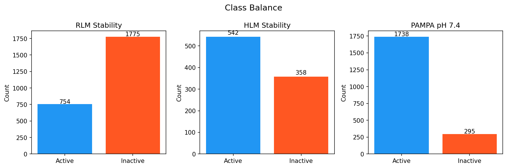

*Binary label distributions. HLM is roughly balanced; PAMPA is heavily
imbalanced (86% permeable), motivating AUC-PR as the primary metric.*

#### Molecule overlap

| Pair | Shared Molecules | % of Smaller Set | Shared Scaffolds | % of Smaller Set |
|---|---|---|---|---|
| RLM ∩ HLM | 50 | 5.6% | 94 | 12.9% |
| RLM ∩ PAMPA | 2,023 | 99.5% | 1,385 | 99.6% |
| HLM ∩ PAMPA | 41 | 4.6% | 84 | 11.6% |

RLM and PAMPA share 99.5% of molecules (same compound library), making
the RLM->PAMPA transfer a clean test where any benefit must come from
representation learning, not exposure to new chemical matter. HLM has
minimal overlap with either endpoint.

#### Continuous value distributions

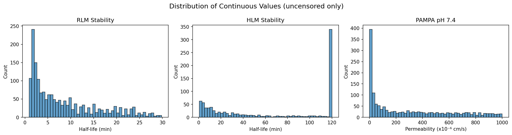

*Raw continuous assay values before binarization. Censored values
(at assay limits) shown separately.*

#### Chemical space (PaCMAP)

Morgan fingerprints (2048-bit, radius 3) embedded to 2D via PaCMAP.
A single shared embedding across all endpoints.

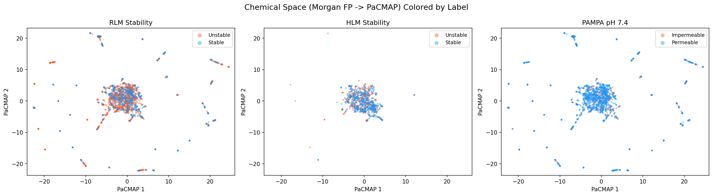

*2D PaCMAP embedding of Morgan fingerprints, colored by binary label.
Single shared embedding across all endpoints.*

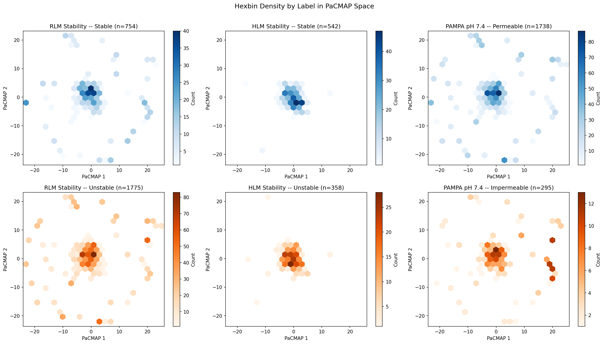

*Same embedding as hexbin density plot, showing compound density
across chemical space.*

### Splitting strategy

Following [Walters' methodology](https://practicalcheminformatics.blogspot.com/2024/11/some-thoughts-on-splitting-chemical.html),
PaCMAP-based clustering splits are used instead of Murcko scaffold
splits. This prevents data leakage from structural similarity: molecules
in different folds are guaranteed to occupy distinct regions of chemical
space, so performance on the test fold reflects generalization to
genuinely new chemical matter rather than interpolation between similar
training examples.

1. Morgan fingerprints -> PaCMAP 2D embedding
2. KMeans (k=50) clustering in PaCMAP space
3. Cluster assignments as groups for `GroupKFoldShuffle`
4. 5 replicates x 5 folds = 25 train/test splits per experiment
5. Same splits across all model types for paired comparisons

#### Fold quality assessment

Two diagnostics confirm the splits produce chemically distinct,
non-redundant folds.

**Chemical distinctness (5-NN Tanimoto distance).** For each molecule in
the test fold, we compute the Tanimoto distance to its 5 nearest
neighbors in the training folds (cross-fold) vs within the same test fold
(within-fold). If splits separate chemically distinct neighborhoods,
cross-fold distances should exceed within-fold distances.

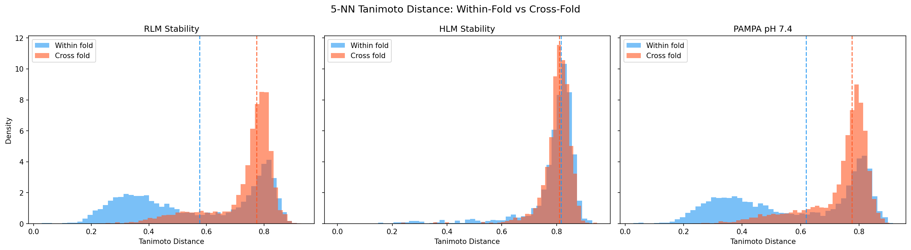

*Distribution of Tanimoto distances to 5 nearest neighbors: within-fold
(same test fold) vs cross-fold (training folds). Larger cross-fold
distances indicate chemically distinct splits.*

| Endpoint | Within-fold median | Cross-fold median | Shift |
|---|---|---|---|
| RLM Stability | 0.576 | 0.774 | +0.198 |
| HLM Stability | 0.816 | 0.811 | -0.005 |
| PAMPA pH 7.4 | 0.619 | 0.775 | +0.156 |

RLM and PAMPA show clear separation: cross-fold 5-NN distances are
substantially larger than within-fold, confirming molecules in the test
fold are more chemically distant from the training set than from their
own fold-mates. HLM shows minimal shift, likely because the dataset is
small (900 compounds) and the chemical space is compact -- even molecules
in different folds are not far apart.

**Replicate variation (best-match Jaccard).** For each fold in replicate
A, we find the fold in replicate B with the highest molecule overlap
(Jaccard similarity). Since fold indices are arbitrary, this best-match
comparison avoids penalizing mere index permutations -- it measures
whether the shuffled replicates produce genuinely different partitions.

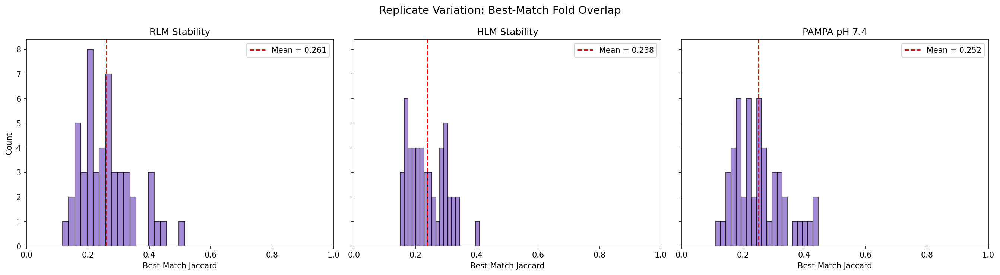

*Best-match Jaccard similarity between folds across replicates. Low
values (~0.25) confirm the 5 replicates produce genuinely different
partitions.*

| Endpoint | Mean best-match Jaccard | Range |
|---|---|---|
| RLM Stability | 0.261 | 0.117 -- 0.516 |
| HLM Stability | 0.238 | 0.150 -- 0.409 |
| PAMPA pH 7.4 | 0.252 | 0.111 -- 0.445 |

Even the most overlapping fold pair across replicates shares only ~25%
of molecules on average. The 5 replicates produce meaningfully different
partitions, which is why the 5x5 CV provides 25 non-redundant performance
estimates for statistical testing.

### Metric choice: AUC-PR over AUC-ROC

PAMPA has severe class imbalance (86% permeable / 14% impermeable). Under
AUC-ROC, a model can score well by correctly classifying the large
majority class while failing on the minority class. AUC-PR (Average
Precision) focuses on precision-recall performance and is more sensitive
to minority-class errors.

We report AUC-PR as the primary metric throughout. The random-classifier
baseline for AUC-PR equals the positive class prevalence: 0.602 for HLM
and 0.855 for PAMPA. All conclusions were also verified under AUC-ROC,
which produces the same qualitative story (same best-group membership,
same catastrophic XGBoost failure); AUC-ROC values are included in the
supplementary tables for reference.

### Supplementary: AUC-ROC results

For comparison with prior literature that reports AUC-ROC, the full
results under that metric are below. Rankings and best-group membership
are similar but not identical to AUC-PR.

| Target | Model | AUC-ROC (mean +/- std) | Best group |
|---|---|---|---|
| **HLM Stability** | XGBoost scratch | 0.668 +/- 0.046 | |
| | Chemprop scratch | 0.721 +/- 0.038 | |
| | XGBoost RLM-transfer | 0.734 +/- 0.046 | * |
| | CheMeleon single-finetune | 0.739 +/- 0.037 | * |
| | CheMeleon frozen single | 0.755 +/- 0.034 | * |
| | CheMeleon frozen double | 0.756 +/- 0.034 | * |
| | CheMeleon double-finetune | 0.764 +/- 0.038 | * |
| | **Chemprop RLM-transfer** | **0.768 +/- 0.042** | **\*** |
| **PAMPA pH 7.4** | XGBoost RLM-transfer | 0.509 +/- 0.069 | |
| | XGBoost scratch | 0.659 +/- 0.050 | |
| | CheMeleon single-finetune | 0.676 +/- 0.044 | |
| | CheMeleon double-finetune | 0.686 +/- 0.044 | * |
| | Chemprop scratch | 0.701 +/- 0.053 | * |
| | Chemprop RLM-transfer | 0.716 +/- 0.038 | * |
| | CheMeleon frozen single | 0.730 +/- 0.055 | * |
| | **CheMeleon frozen double** | **0.730 +/- 0.056** | **\*** |

### Supplementary figures

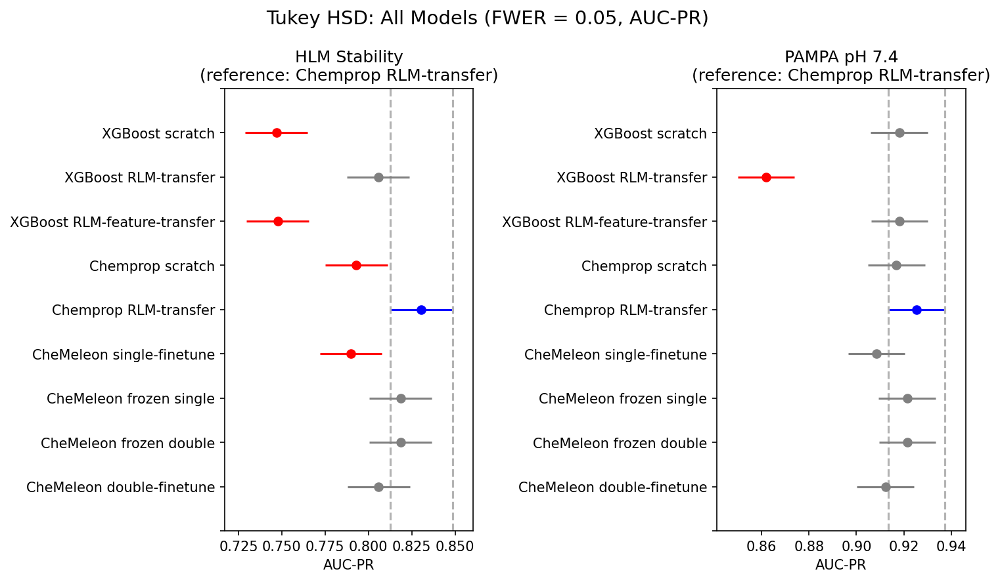

Tukey HSD simultaneous confidence intervals (AUC-PR, FWER = 0.05). The
reference model (highest mean) is highlighted. Groups colored red are
significantly different from the reference. Groups colored gray are not
significantly different. Non-overlapping intervals between any two groups
indicate a significant difference. Note: all intervals within each panel
have identical widths -- this is expected with balanced group sizes (n=25);
see [docs/tukey-hsd-interval-widths.md](docs/tukey-hsd-interval-widths.md)
for details.

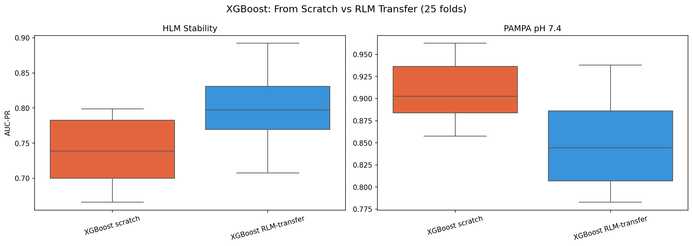

*XGBoost-only comparison: scratch vs RLM-transfer on both endpoints.*

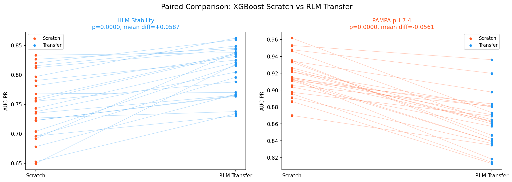

*Paired fold comparison (lines connect same fold). Blue = transfer wins,
red = scratch wins.*

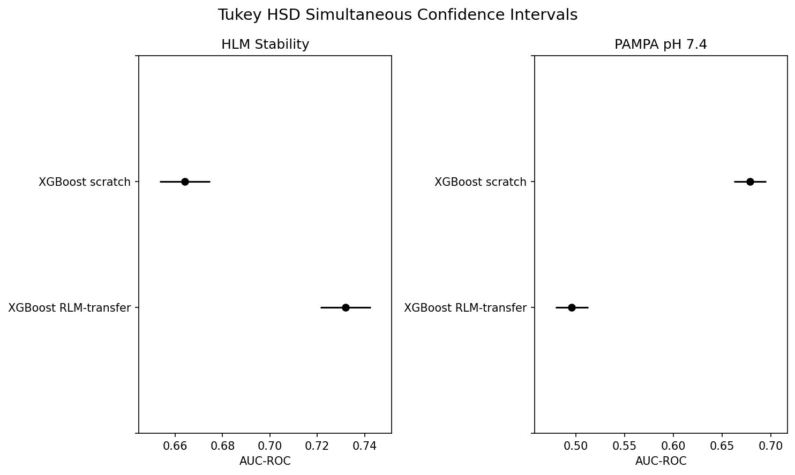

*XGBoost-only Tukey HSD (FWER = 0.05).*

---

## Project Structure

```
xfer-learning/
  pyproject.toml                       # UV project config
  notebooks/
    01-data-acquisition.py             # Marimo: download + curate NCATS data
    02-eda.py                          # Marimo: EDA, splits, fold quality
    03-train-baselines.py              # Marimo: XGBoost baselines
    04-train-chemprop.py               # Marimo: Chemprop results visualization
    05-chemeleon.py                    # Marimo: CheMeleon + combined comparison
    06-analysis.py                     # Marimo: final analysis and discussion
    07-chemeleon-frozen.py             # Marimo: frozen encoder comparison
    08-failure-analysis.py             # Marimo: XGBoost SHAP failure cases
    09-chemprop-saliency.py            # Marimo: Chemprop gradient saliency
    10-hlm-importance.py               # Marimo: HLM feature importance (XGBoost + Chemprop)
    11-rlm-base-comparison.py          # Marimo: RLM base model equivalence validation
    12-pampa-importance.py             # Marimo: PAMPA feature importance (XGBoost + Chemprop)
  scripts/
    run-chemprop-training.py           # Chemprop CV training with disk caching
    run-chemeleon-training.py          # CheMeleon CV training with disk caching
    run-chemeleon-frozen-training.py   # CheMeleon frozen encoder training
    run-xgb-ablation.py               # XGBoost transfer ablation experiment
    run-rlm-base-eval-xgb.py          # RLM base eval: XGBoost (run first)
    run-rlm-base-eval-nn.py           # RLM base eval: Chemprop + CheMeleon (merges results)
  src/xfer_learning/                   # Package (placeholder)
  data/                                # Downloaded/processed data (gitignored)
  docs/
    initial-plan.md                    # Experiment design document
    chemeleon-overfitting.md           # CheMeleon overfitting narrative
    xgb-transfer-ablation.md           # XGBoost ablation results
    tukey-hsd-interval-widths.md       # Statistical method note
    figures/                           # Exported plots
```

## Running

```bash
# Install dependencies
uv sync

# Run notebooks interactively (in order)
uv run marimo edit notebooks/01-data-acquisition.py
uv run marimo edit notebooks/02-eda.py
uv run marimo edit notebooks/03-train-baselines.py

# Run training scripts (standalone, with per-fold caching)
uv run python scripts/run-chemprop-training.py
uv run python scripts/run-chemeleon-training.py
uv run python scripts/run-chemeleon-frozen-training.py
uv run python scripts/run-xgb-ablation.py
uv run python scripts/run-rlm-base-eval-xgb.py
uv run python scripts/run-rlm-base-eval-nn.py

# View results
uv run marimo edit notebooks/04-train-chemprop.py
uv run marimo edit notebooks/05-chemeleon.py
uv run marimo edit notebooks/06-analysis.py
uv run marimo edit notebooks/07-chemeleon-frozen.py
uv run marimo edit notebooks/08-failure-analysis.py
uv run marimo edit notebooks/09-chemprop-saliency.py
uv run marimo edit notebooks/10-hlm-importance.py
uv run marimo edit notebooks/11-rlm-base-comparison.py
uv run marimo edit notebooks/12-pampa-importance.py
```

## References

- Walters, P. [Some Thoughts on Splitting Chemical Datasets](https://practicalcheminformatics.blogspot.com/2024/11/some-thoughts-on-splitting-chemical.html). Practical Cheminformatics, 2024.
- Walters, P. [Even More Thoughts on ML Method Comparison](https://practicalcheminformatics.blogspot.com/2025/03/even-more-thoughts-on-ml-method.html). Practical Cheminformatics, 2025.
- Chemprop: [github.com/chemprop/chemprop](https://github.com/chemprop/chemprop)
- CheMeleon: [github.com/JacksonBurns/chemeleon](https://github.com/JacksonBurns/chemeleon) / [Zenodo](https://zenodo.org/records/15460715)
- NCATS ADME: [opendata.ncats.nih.gov/adme](https://opendata.ncats.nih.gov/adme)
