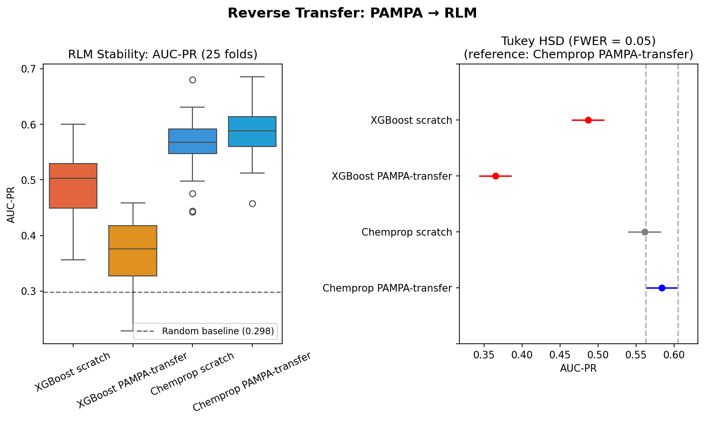

# Reverse Transfer Experiment: PAMPA → RLM

## Motivation

The main experiment tests RLM → HLM (related, transfer helps) and
RLM → PAMPA (unrelated, transfer hurts XGBoost). A natural follow-up:
does the same pattern hold in the opposite direction? If we pre-train
on PAMPA and finetune on RLM, does XGBoost again suffer catastrophic
negative transfer while Chemprop remains robust?

This tests whether the architectural vulnerability is symmetric -- i.e.,
whether XGBoost's inability to recover from irrelevant pre-training is a
general property of decision-boundary transfer, not specific to the
RLM→PAMPA direction.

## Experiment

Four models evaluated on RLM Stability using the same 5x5 CV splits:

- **XGBoost scratch**: trained directly on RLM
- **XGBoost PAMPA-transfer**: pre-trained on PAMPA, continue boosting on RLM
- **Chemprop scratch**: D-MPNN trained directly on RLM
- **Chemprop PAMPA-transfer**: D-MPNN pre-trained on PAMPA, new FFN head, finetune on RLM

## Results



*(Results to be filled after running notebook 14.)*

## Interpretation

*(To be filled after results are available.)*

## Notebook

```bash
uv run marimo export html notebooks/14-reverse-transfer.py -o notebooks/14-reverse-transfer.html
```
